# AIDocumentAgent

**AI agents that read, check and document technical, legal and clinical files.**

AIDocumentAgent reviews engineering drawings against ISO and ASME standards, synthesises insights across whole collections of legal documents, and answers clinical questions from your own files. Every finding is located, every answer is sourced, and anything the system cannot verify is flagged instead of filled in.

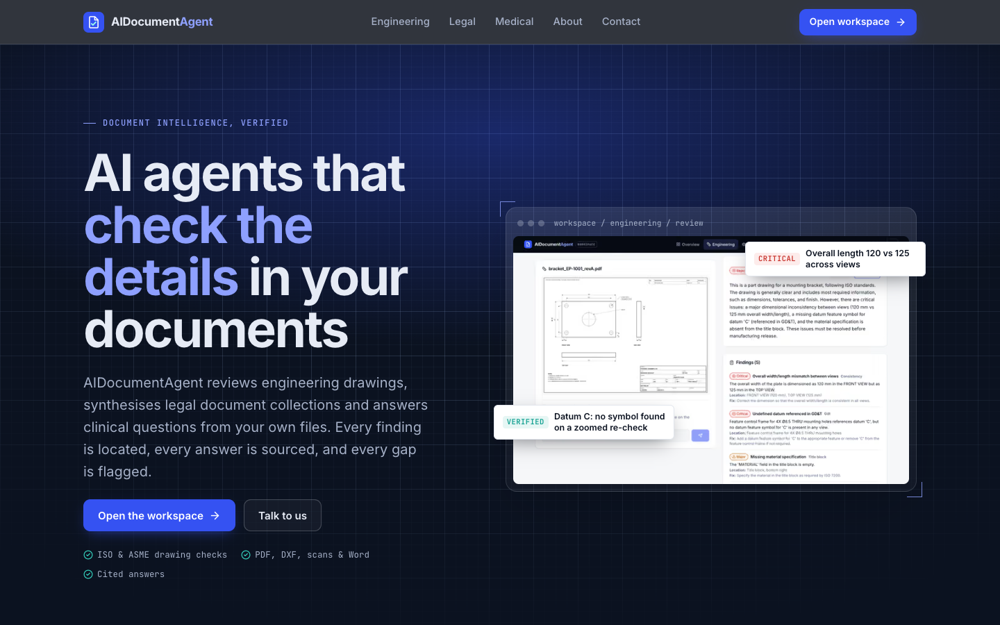

<p align="center">
  <a href="#screenshots">Screenshots</a> ·
  <a href="#features">Features</a> ·
  <a href="#admin-panel">Admin</a> ·
  <a href="#architecture">Architecture</a> ·
  <a href="#getting-started">Getting started</a> ·
  <a href="#configuration">Configuration</a> ·
  <a href="#api-reference">API</a> ·
  <a href="#evaluation">Evaluation</a> ·
  <a href="#roadmap">Roadmap</a>
</p>

---

## Contents

- [Overview](#overview)
- [Screenshots](#screenshots)
- [Features](#features)
- [Admin panel](#admin-panel)
- [Architecture](#architecture)
- [Agent workflows](#agent-workflows)
- [Tech stack](#tech-stack)
- [Project structure](#project-structure)
- [Getting started](#getting-started)
- [Configuration](#configuration)
- [Sample data](#sample-data)
- [API reference](#api-reference)
- [Website: SEO and performance](#website-seo-and-performance)
- [Evaluation](#evaluation)
- [Quality assurance](#quality-assurance)
- [Security and data handling](#security-and-data-handling)
- [Troubleshooting](#troubleshooting)
- [Roadmap](#roadmap)
- [Further documentation](#further-documentation)

---

## Overview

AIDocumentAgent has three parts:

| Part | What it is | Where |
|---|---|---|
| **Website** | Public marketing site: Home, Solutions, About, Contact. Statically rendered with full technical SEO. | `frontend/app/(site)` → http://localhost:3001 |
| **Workspace** | The application: Engineering, Legal and Medical workspaces plus system status. Requires sign-in. | `frontend/app/(workspace)` → http://localhost:3001/workspace |
| **Admin panel** | Analytics (traffic, usage, model cost), users, contact inbox, activity log, system health. Admins only. | http://localhost:3001/admin |
| **API** | FastAPI back end running the LangGraph agents, vector search and storage. | `backend/` → http://localhost:8000/docs |

The three workspaces share one design principle: **models do the reading, but deterministic checks, targeted re-verification and explicit gap-flagging make the results auditable.** A qualified person always makes the final call.

---

## Screenshots

### Website

| Workflow | Verification guardrails |
|---|---|
| 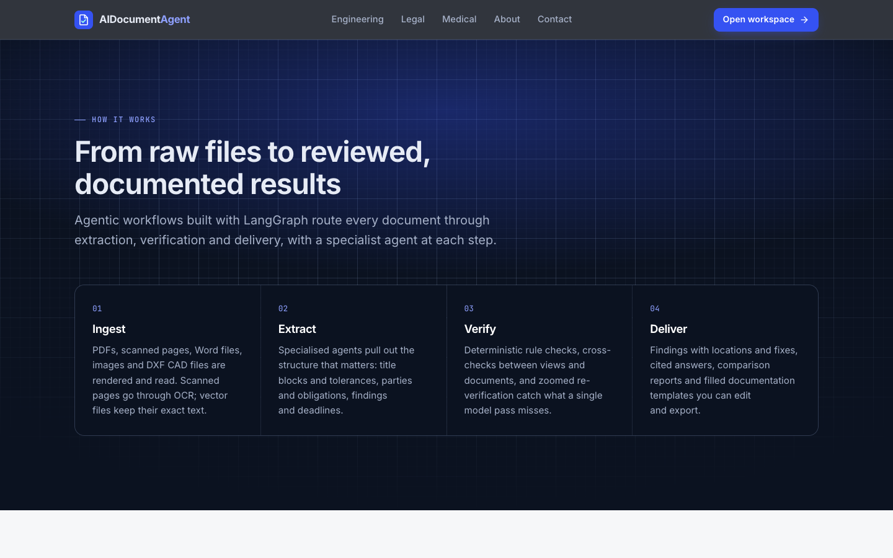 | 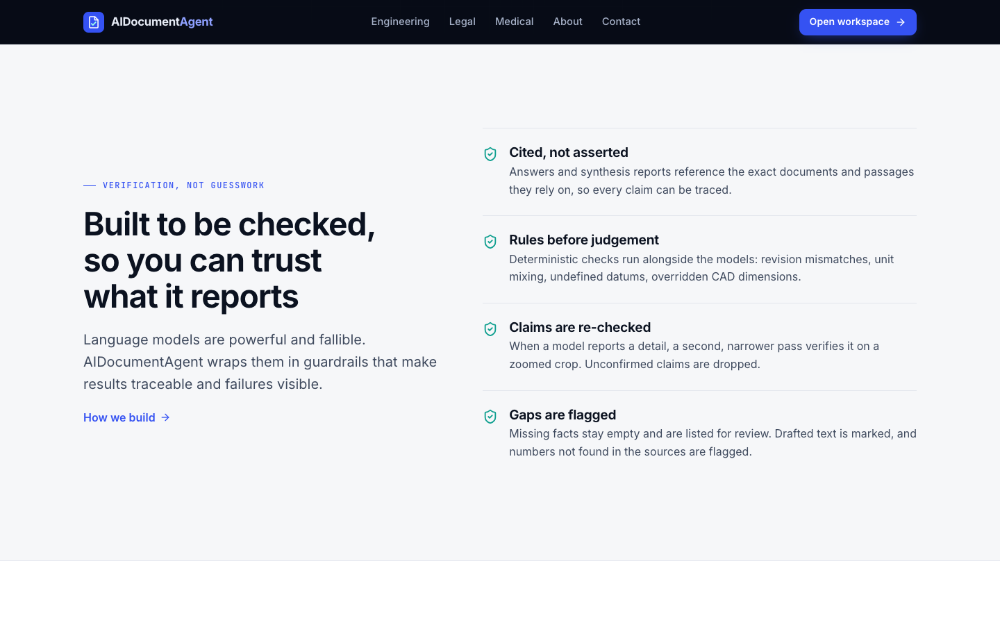 |

| Engineering solution page | Measured results |
|---|---|
| 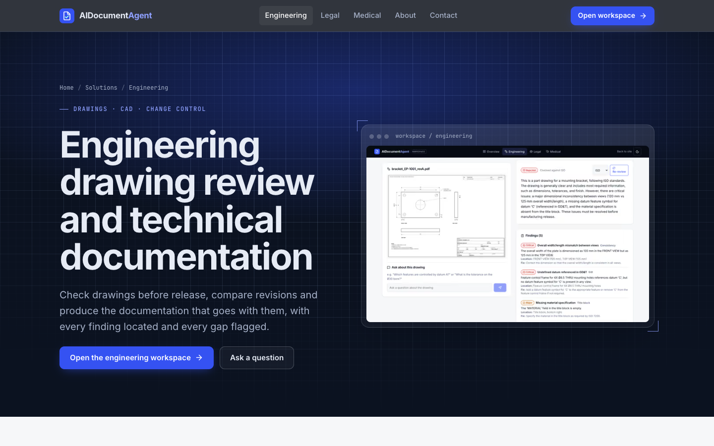 | 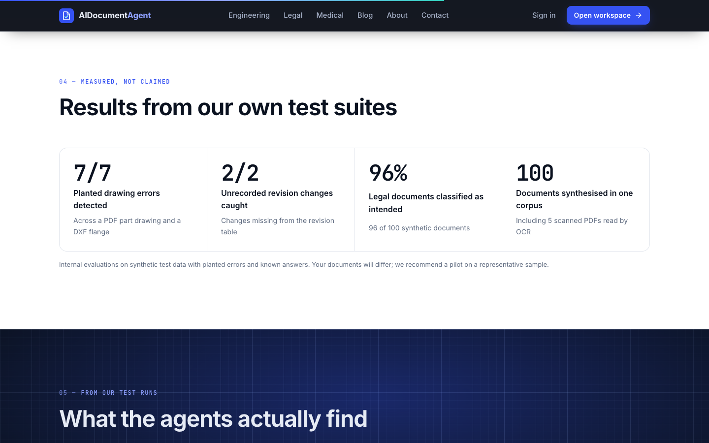 |

| About | Contact |
|---|---|
| 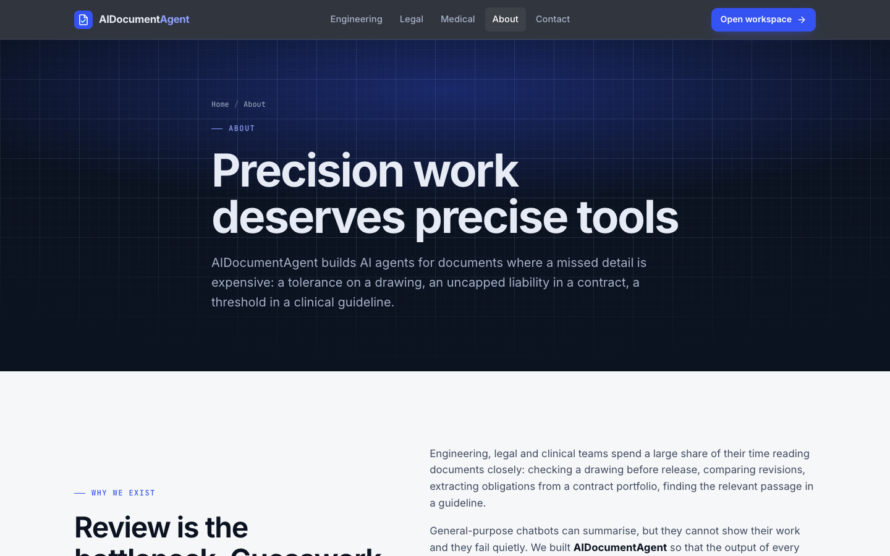 | 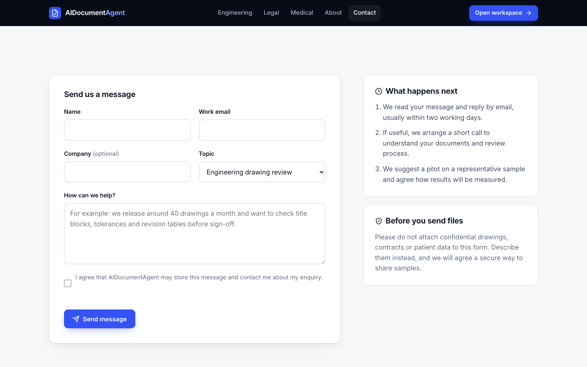 |

**Mobile** (390 px: home, navigation menu, contact form)

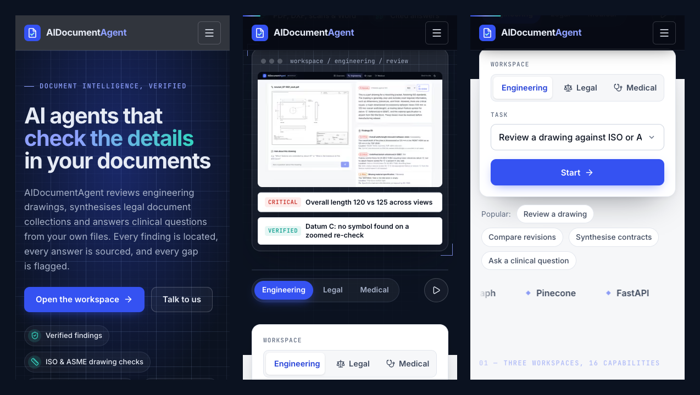

### Sign-in and admin panel

| Sign-in | Admin overview |
|---|---|
| 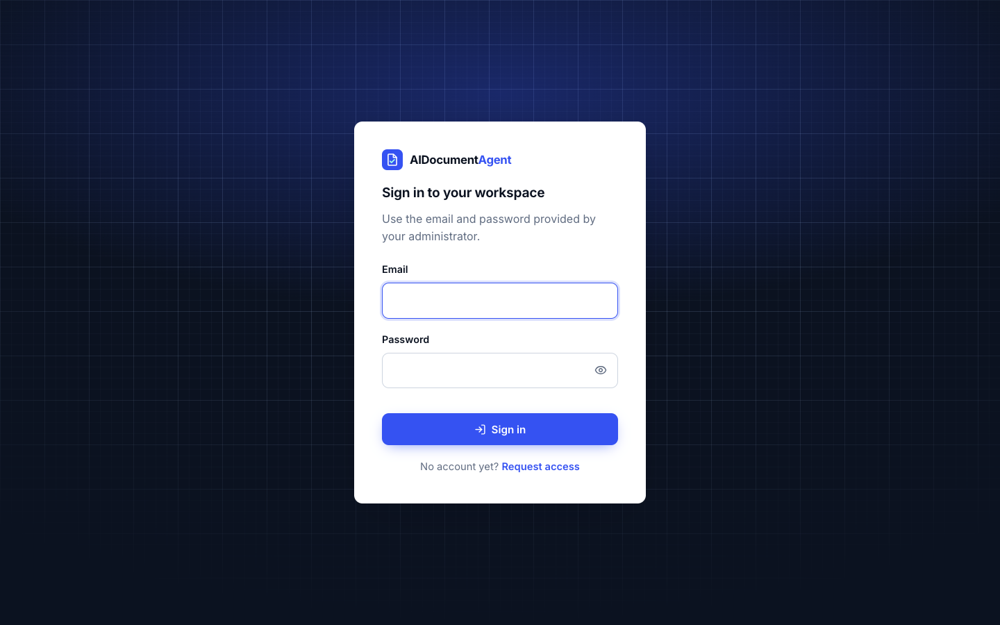 | 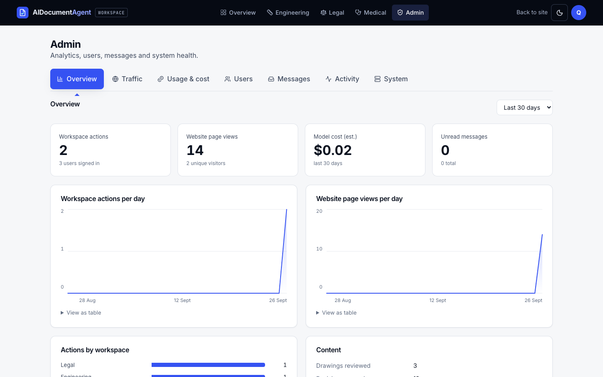 |

See **[Admin panel](#admin-panel)** for every admin screen and a how-to guide.

### Workspace

| Engineering: drawing review | Engineering: revision comparison |
|---|---|
| 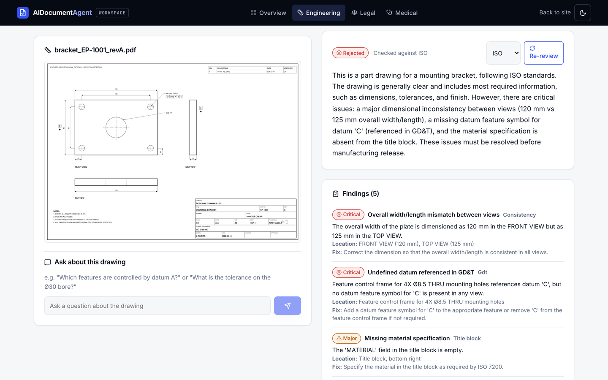 | 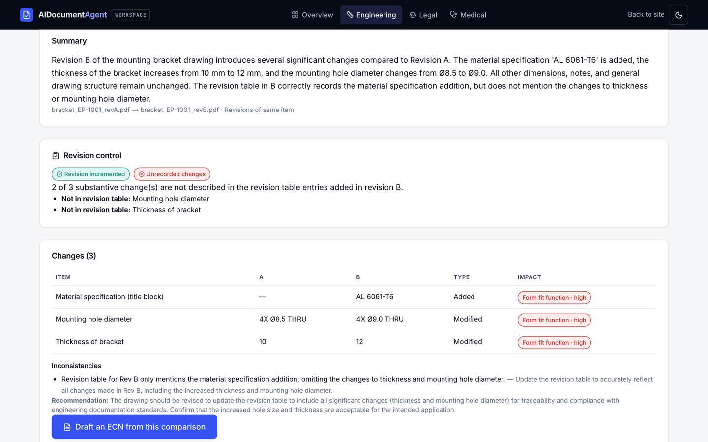 |

| Legal: corpus dashboard | Medical: grounded Q&A |
|---|---|
| 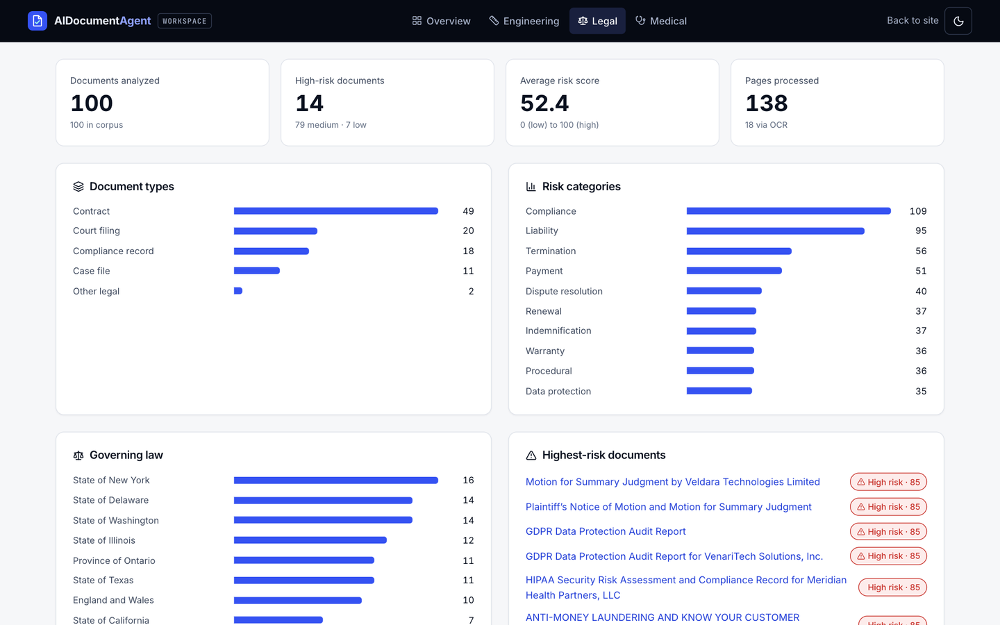 | 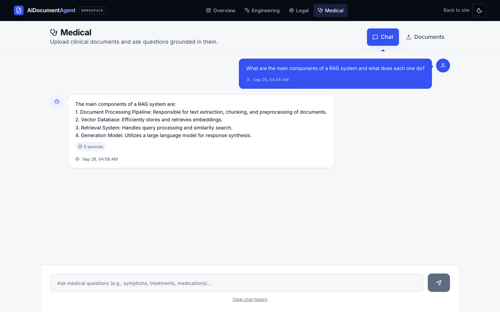 |

---

## Features

### 📐 Engineering: drawing review and technical documentation

- **Drawing review** of PDF, PNG/JPG/TIFF and **DXF CAD** files against **ISO** (128, 129-1, 1101, 7200, 2768) or **ASME** (Y14.5, Y14.100, Y14.35) checklists.
- **Vision extraction** of title block, views, dimensions, tolerances, GD&T, datums, notes, revision table and BOM. Each sheet is read as a full image plus four zoomed tiles, combined with the exact PDF text layer or CAD entities.
- **Datum verification**: every claimed datum symbol is re-checked on a zoomed crop, and unconfirmed claims are dropped.
- **Deterministic rule checks**: title-block completeness, revision consistency, unit mixing, tolerance coverage, undefined datums, conflicting dimensions, sheet numbering, **CAD dimension text overridden to hide a geometry mismatch**, CAD units versus title block.
- **Cross-view consistency agent**: extents across views, dimension chains, callouts.
- **Verdict guardrail**: approved / approved with comments / rejected. The verdict can never be more lenient than the worst finding.
- **Revision comparison**: every change with form/fit/function impact, plus a **revision-control audit** that checks each substantive change against the new revision-table entries.
- **Documentation templates**: ECN, First Article Inspection (AS9102-style), Drawing Review Record, Release & Transmittal, Component Technical Specification. You can edit them, get an AI review with an improved version, or **import** your own from DOCX/PDF/TXT/MD.
- **Document generation** from reviewed drawings and comparisons, with export to **Word** and **Markdown**:
  - facts are copied from the sources; missing facts stay empty and are flagged;
  - drafted analysis is marked `[DRAFT]`;
  - **any number not found in the sources is flagged**.
- **Q&A about a drawing**, grounded in the images, extracted data and findings.

### ⚖️ Legal: document intelligence and cross-document synthesis

- **Batch ingestion** of up to 100 documents per batch (configurable). Documents are processed in the background, with progress tracking and automatic resume after a restart.
- **OCR** for scanned PDFs and images using a vision model; DOCX, TXT and MD are also supported.
- **Classification**: contract, court filing, case file, compliance record, other legal, non-legal, plus subtype and jurisdiction.
- **Structured extraction**: parties, key dates, obligations, monetary amounts, clauses and type-specific fields (liability caps, case numbers, remediation deadlines…).
- **Risk analysis**: calibrated 0–100 score, categorised risks with section references and recommendations, and missing protections.
- **Corpus dashboard**: document types, risk levels, risk categories, governing law, highest-risk documents, upcoming deadlines.
- **Cross-document synthesis** (plan → retrieve → map → reduce): a cited report with themes, comparisons, risks, outliers and recommendations.
- **Cited Q&A** (full-document reading for short single documents, retrieval otherwise) and **semantic search**.
- Legal vectors live in a **dedicated Pinecone namespace**, isolated from the rest of the index.

### 🩺 Medical: clinical Q&A over your own documents

- Upload **PDFs and CSV datasets**. CSVs get a size and time estimate before upload.
- **Grounded answers** from retrieved passages, with a source count; the assistant says when the context is insufficient.
- **Identifier removal**: CSV columns that look like patient identifiers (names, IDs, contact details, dates of birth) are dropped before indexing.
- Replace or delete indexed documents at any time.

### 🔐 Accounts, admin panel and analytics

- **Sign-in** with email and password.
  - Passwords are hashed with PBKDF2-HMAC-SHA256 (600,000 iterations).
  - Sessions are random tokens in an **HttpOnly, SameSite=Lax** cookie; only a SHA-256 digest of each token is stored.
- **Roles**: `admin` and `member`.
  - Every workspace API requires sign-in; admin APIs require the admin role.
  - At least one active admin is always kept.
- **Invite-only**: admins invite users by email; each person chooses their own password through a single-use link (valid 72 hours). Admins never see or set passwords.
- **Forgot password**: self-service reset by emailed single-use link (60 minutes). The response is identical whether or not the account exists.
- **Private workspaces**: members see only the documents, drawings and reports they uploaded or created; admins see everything. Templates are shared.
- **Protection**:
  - failed sign-ins are throttled per email and per IP address;
  - errors are generic, and verification runs in constant time;
  - an origin guard provides CSRF defence, with explicit CORS origins;
  - changing a password signs out other sessions.
- **Two-factor authentication (TOTP)**:
  - enrol from the Account page by QR code or manual key; works with Google Authenticator, Microsoft Authenticator, 1Password, Authy and others;
  - 10 single-use recovery codes, stored as hashes;
  - replay protection, and a limit of 5 attempts per sign-in challenge;
  - admins can see who has 2FA and reset it for a user who lost their phone.
- **Account page**: change password, manage 2FA and recovery codes, see active sessions, sign out other devices.
- **Admin panel**:
  - **Overview**:
    - KPIs with **change against the previous period**;
    - a live **"right now"** card (visitors and signed-in users in the last 5 minutes);
    - contact conversions and conversion rate;
    - daily actions and page views, actions by workspace, content counts, recent activity.
  - **Traffic**: page views, daily unique visitors, conversion rate, contact conversions per day, landing pages, top blog posts, top pages, referrers, devices, and CSV export.
  - **Posts**: a blog content manager.
    - Markdown editor with a formatting toolbar and write/preview modes (same renderer and sanitiser as the live page).
    - Cover and inline image uploads, re-encoded to WebP.
    - Tags, URL slug, SEO title and description with counters, and a Google result preview.
    - Drafts, publishing and **scheduling** (a future publish date).
    - Per-post views chart.
  - **Settings**: announcement bar (message, link, style, live preview) and switches for the contact form and website analytics.
  - **Usage & cost**: model calls, tokens and **estimated cost** by day, model and feature; most-used actions; activity per user.
  - **Users**: invite, change role, disable or enable, reset password, delete.
  - **Messages**: contact-form inbox with read/unread, reply, delete and CSV export.
  - **Activity**: filterable audit log of sign-ins, workspace actions and admin changes, with CSV export.
  - **System**: vector database namespaces, storage use, configured models, security settings.
- **Privacy-friendly website analytics**:
  - first-party beacon, no cookies;
  - IP addresses are never stored, and visitor IDs are salted hashes that reset daily;
  - Do Not Track is respected and bots are excluded.

### 📝 Blog

- Public `/blog` listing and `/blog/[slug]` articles, statically generated and refreshed every 60 seconds.
- The API triggers an **immediate refresh** through `/api/revalidate` (shared secret) whenever a post or setting changes.
- Each article has canonical URLs, Open Graph article metadata, **BlogPosting** JSON-LD, breadcrumbs, reading time and related posts.
- Published posts are added to the sitemap automatically.
- Post HTML is rendered from Markdown and **sanitised with an allow-list** (nh3) on the server when saved.

### 🌐 Website

- Next.js App Router in **JavaScript**, statically rendered public pages.
- Design system: ink sections with a drafting-grid motif, one indigo accent, Inter + JetBrains Mono via `next/font`, and real product screenshots with drawing-style callouts.
- **Technical SEO**:
  - metadata and canonical URLs on every page;
  - `sitemap.xml`, `robots.txt`, web manifest;
  - generated Open Graph images;
  - JSON-LD structured data and semantic HTML.
- Contact form with client and server validation, a honeypot and per-IP rate limiting.

---

## Admin panel

The admin panel is where administrators run the product: analytics, content, users, messages, settings and system health. It lives at **http://localhost:3001/admin** and is visible only to accounts with the **admin** role.

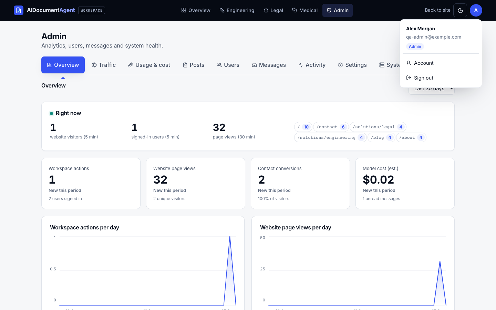

### Access

1. **Create the first administrator** (once, on the server):
   ```bash
   cd backend
   venv/bin/python manage.py create-admin --email you@example.com --name "Your Name"
   ```
   A temporary password is printed **once** (this bootstrap step is the only time a password is generated).
2. **Sign in** at http://localhost:3001/login.
3. **Choose a new password.** You're asked to replace the temporary one before anything else.
4. Open **Admin** from the workspace navigation, or go to `/admin` directly.

Forgotten password: use **Forgot password?** on the sign-in page. Without email configured, the server command
`venv/bin/python manage.py reset-password --email you@example.com` prints a new temporary password and signs out that
account's sessions.

| First sign-in: forced password change | Account page: password and active sessions |
|---|---|
| 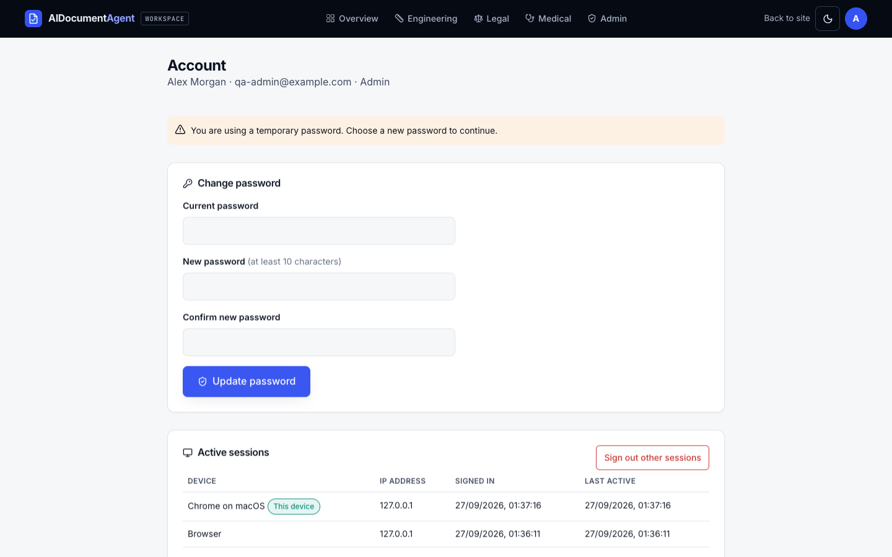 | 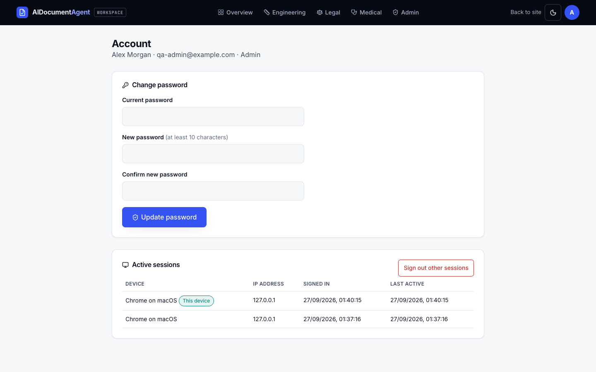 |

**Two-factor authentication**

| Set up with an authenticator app | Save recovery codes | Sign in with a code |
|---|---|---|
| 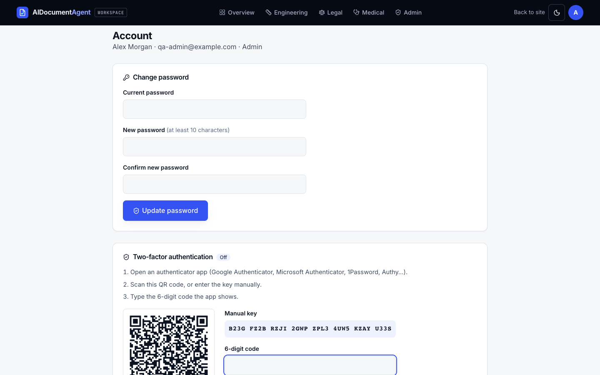 | 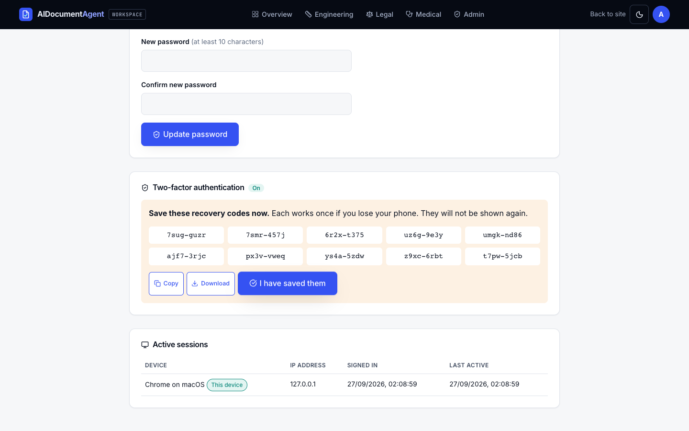 | 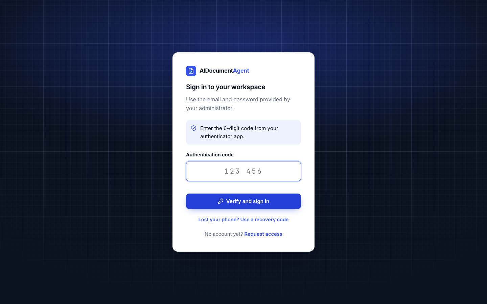 |

### Sections at a glance

| Section | What you see | What you can do |
|---|---|---|
| **Overview** | Live "right now" card, KPIs with change vs the previous period, daily workspace actions and page views, actions by workspace, content counts, recent activity | Switch the range (7 / 30 / 90 days) |
| **Traffic** | Page views, daily unique visitors, conversion rate, contact conversions per day, landing pages, top blog posts, top pages, referrers, devices | Switch range, **export CSV** |
| **Usage & cost** | Model calls, input/output tokens, **estimated OpenAI cost** per day, by model and by feature; most-used actions; actions per user | Switch range |
| **Posts** | All posts with status (draft / scheduled / published) and views (30 days / all time) | Create, edit, publish, schedule, unpublish, delete |
| **Users** | Every account with role, status, last sign-in and activity | Invite users, change roles, disable/enable, reset passwords, delete |
| **Messages** | Contact-form inbox with read/unread state and topic breakdown | Mark read/unread, reply by email, delete, **export CSV** |
| **Activity** | Audit log: sign-ins (including failures), workspace actions, content and admin changes | Filter by area and action, page through, **export CSV** |
| **Settings** | Announcement bar and website feature switches | Show a site-wide announcement; pause the contact form; turn analytics on/off |
| **System** | Vector-database namespaces, storage per data folder, configured models, security settings | Check health at a glance |

### Screens

| Overview | Traffic |
|---|---|
|  | 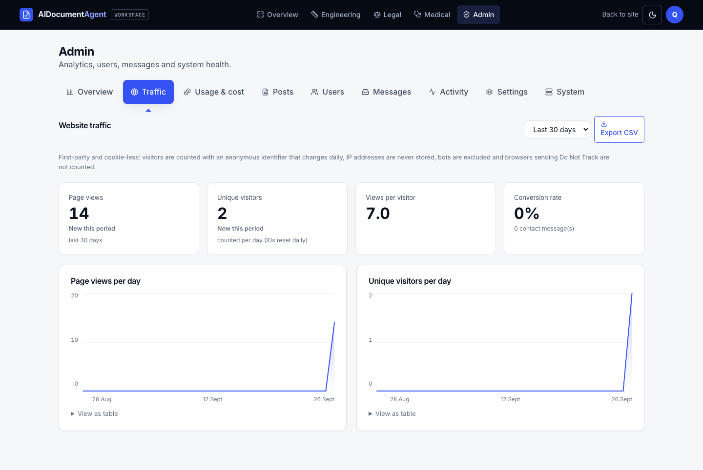 |

| Usage & cost | Posts |
|---|---|
| 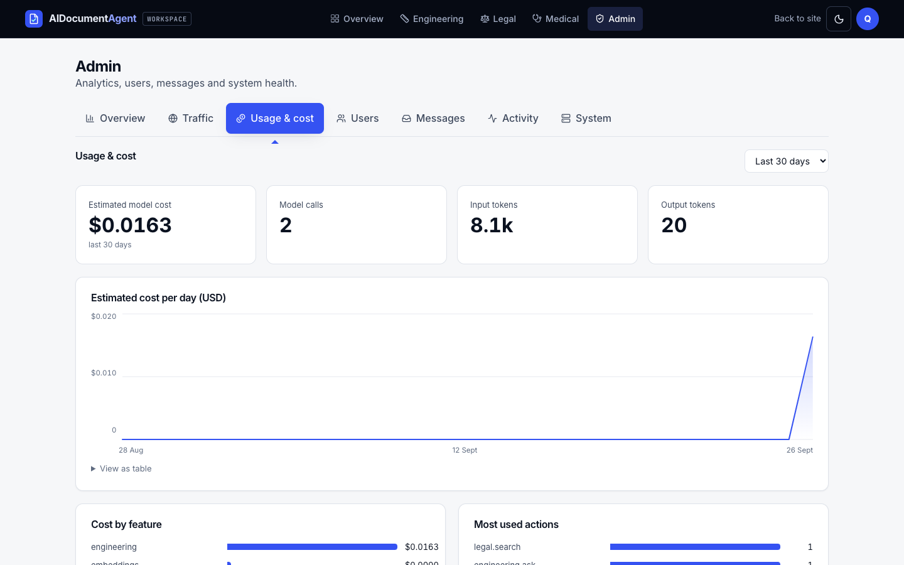 | 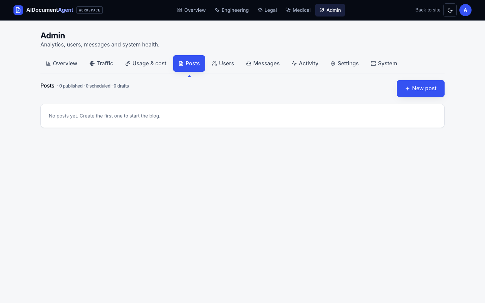 |

| Post editor (Markdown, preview, SEO) | Published article |
|---|---|
| 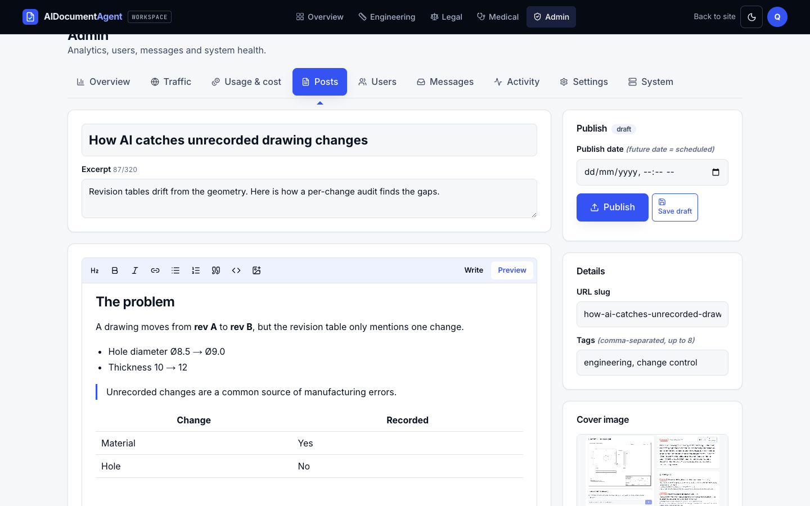 | 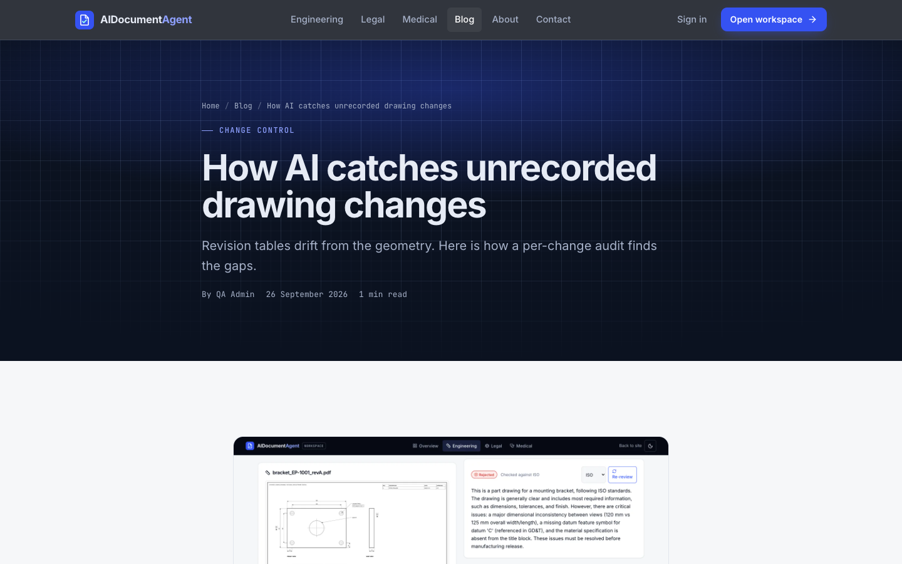 |

| Users | Messages |
|---|---|
| 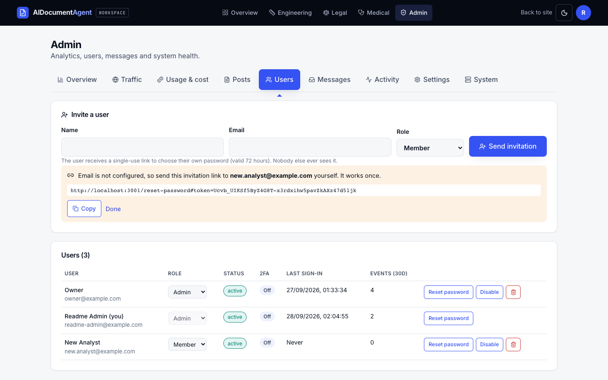 | 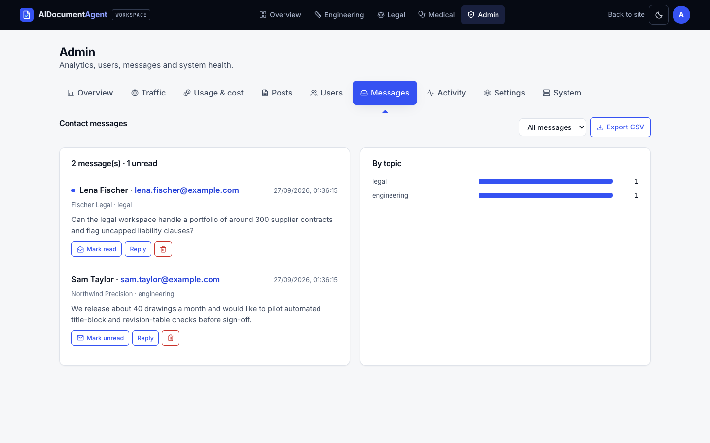 |

| Activity log | Settings |
|---|---|
| 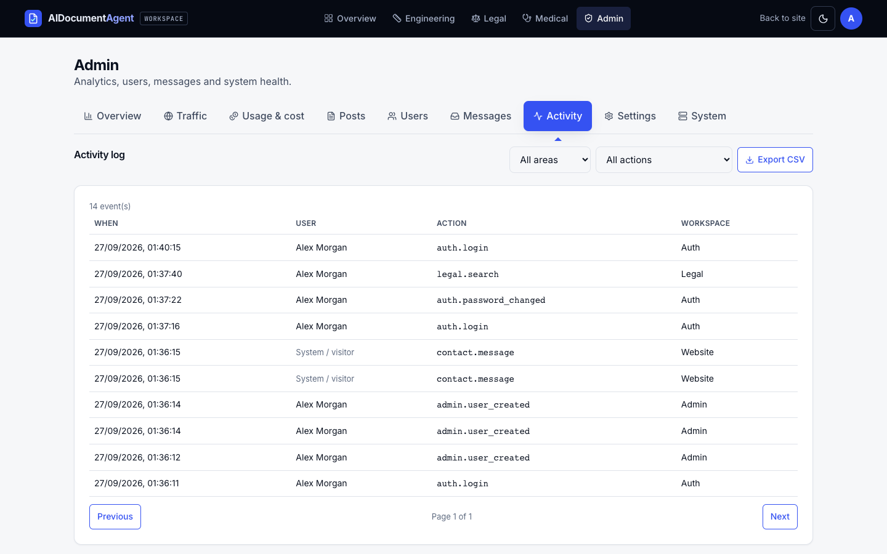 | 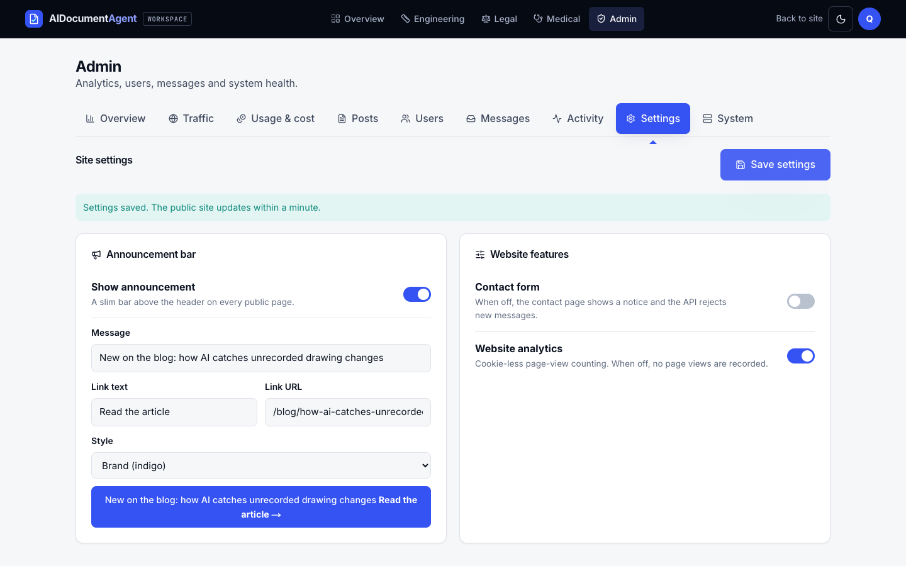 |

| System |
|---|
| 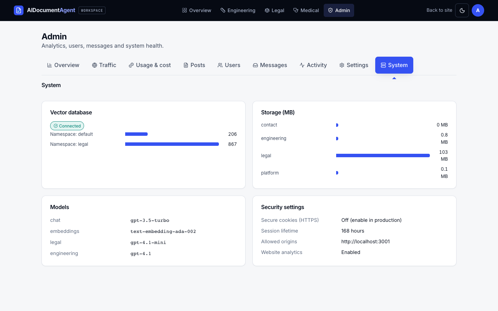 |

### How to…

<details>
<summary><strong>Invite a teammate</strong></summary>

1. **Admin → Users → Invite a user**: enter name and email, choose **Member** (workspaces only) or **Admin**.
2. Click **Send invitation**. The person receives an email with a single-use link to choose their password.
3. Without SMTP configured, the link is shown to you instead. Pass it on securely; it works once and expires in 72 hours.
</details>

<details>
<summary><strong>Remove or lock out a user</strong></summary>

- **Disable** keeps the account and its history but signs the user out everywhere and blocks sign-in; **Enable** restores it.
- **Reset password** stops their current password working, signs out all their sessions and emails them a reset link (or shows it to you if email isn't configured).
- **Delete** removes the account permanently. You cannot delete yourself, and the last active admin cannot be demoted, disabled or deleted.
</details>

<details>
<summary><strong>Write, publish or schedule a blog post</strong></summary>

1. **Admin → Posts → New post**. Add a title (the URL slug fills itself in) and a short excerpt.
2. **Write in Markdown**:
   - use the toolbar for headings, bold, italic, links, lists, quotes, code and images;
   - switch to **Preview** to see exactly what will be published.
3. **Upload a cover image** and add alt text. Uploads are resized and converted to WebP.
4. Fill **Search appearance** (SEO title ≤ 60 characters, meta description ≤ 155) and check the Google-style preview.
5. Click **Publish**, or set a **future publish date** first to **Schedule** it. **Save draft** keeps it private; on a live post the same button **unpublishes** it.
6. The public page at `/blog/<slug>` updates on the next page load and the post joins the sitemap automatically. Views appear in the post's chart and in **Traffic → Top blog posts**.
</details>

<details>
<summary><strong>Show an announcement across the website</strong></summary>

**Admin → Settings → Announcement bar**:
1. Switch on **Show announcement**.
2. Write the message, and optionally add link text and a URL (a site path such as `/blog/…` or an `https://` link).
3. Pick a style and check the live preview, then click **Save settings**.

Turn the switch off to remove it.
</details>

<details>
<summary><strong>Pause the contact form or analytics</strong></summary>

**Admin → Settings → Website features**:
- **Contact form off**: the Contact page shows a notice, and the API refuses new submissions.
- **Analytics off**: no page views are recorded. Existing data is kept.
</details>

<details>
<summary><strong>Track model spend</strong></summary>

**Admin → Usage & cost** shows estimated OpenAI cost per day, per model (calls and tokens) and per feature (engineering, legal, OCR, medical chat, embeddings), plus which users drive activity.

Estimates use list prices in `backend/services/usage_tracker.py`; update `PRICING` if provider prices change.
</details>

<details>
<summary><strong>Export data</strong></summary>

- **Traffic → Export CSV**: daily page views, visitors and contact messages for the selected range.
- **Messages → Export CSV**: every contact message.
- **Activity → Export CSV**: the audit log, respecting the current filters.

Exports neutralise spreadsheet formula injection.
</details>

### Roles and permissions

| Capability | Member | Admin |
|---|:---:|:---:|
| Engineering, Legal and Medical workspaces (own documents) | ✅ | ✅ |
| See every user's documents | – | ✅ |
| Own account: change password, manage sessions | ✅ | ✅ |
| Admin panel (analytics, posts, users, messages, activity, settings, system) | – | ✅ |

Every admin change (users, posts, settings, deletions) is written to the **Activity** log with who did it and when.

---

## Architecture

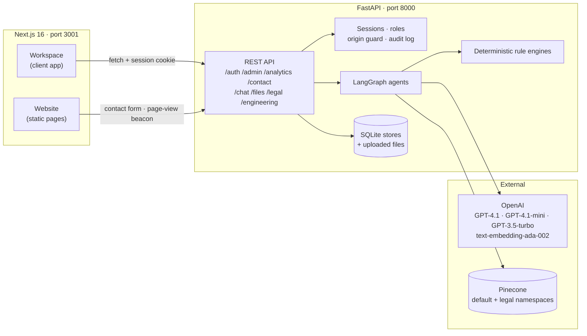
```mermaid
flowchart LR
    subgraph Frontend["Next.js 16 · port 3001"]
        Site["Website<br/>(static pages)"]
        WS["Workspace<br/>(client app)"]
    end

    subgraph Backend["FastAPI · port 8000"]
        API["REST API<br/>/auth /admin /analytics /contact<br/>/chat /files /legal /engineering"]
        Auth["Sessions · roles<br/>origin guard · audit log"]
        Agents["LangGraph agents"]
        Rules["Deterministic rule engines"]
        Stores[("SQLite stores<br/>+ uploaded files")]
    end

    subgraph External
        OpenAI["OpenAI<br/>GPT-4.1 · GPT-4.1-mini · GPT-3.5-turbo<br/>text-embedding-ada-002"]
        Pinecone[("Pinecone<br/>default + legal namespaces")]
    end

    WS -->|fetch + session cookie| API
    Site -->|contact form · page-view beacon| API
    API --> Auth
    API --> Agents
    Agents --> Rules
    Agents --> OpenAI
    Agents --> Pinecone
    API --> Stores
```

**Design decisions**

| Decision | Why |
|---|---|
| **LangGraph** workflows with one specialist agent per step | Each step has a narrow prompt and its own output schema, so it can be tested and inspected on its own. |
| **Deterministic checks alongside models** | Rules such as revision consistency, unit mixing and undefined datums are exact in code and don't vary between runs. |
| **Targeted re-verification** | Vision models sometimes "see" plausible details, such as a datum the design would normally have. A narrow yes/no check on a zoomed crop catches this. |
| **Numeric fact-checking** of generated documents | A corrupted value like `8.9.0` for `9.0` does real damage in engineering documentation. |
| **Separate Pinecone namespace** for legal vectors | The general Chat never retrieves contract passages. |
| **SQLite** for legal, engineering and contact data | Zero-ops, safe for concurrent background workers (WAL mode), easy to inspect. |
| **Server-side sessions** (not JWT) with hashed tokens | Sessions can be revoked instantly (sign-out, password change, disabled user) and a database leak exposes no usable tokens. |
| **Activity logging in middleware** | Every meaningful workspace action is audited without touching each route; model usage is attributed to the signed-in user via a context variable. |
| **Static public pages + client-only workspace** | Public pages are fast and crawlable; the app is `noindex` and loads its own stylesheet. |

---

## Agent workflows

### Engineering drawing review

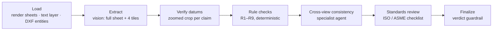
```mermaid
flowchart LR
    A[Load<br/>render sheets · text layer · DXF entities] --> B[Extract<br/>vision: full sheet + 4 tiles]
    B --> C[Verify datums<br/>zoomed crop per claim]
    C --> D[Rule checks<br/>R1–R9, deterministic]
    D --> E[Cross-view consistency<br/>specialist agent]
    E --> F[Standards review<br/>ISO / ASME checklist]
    F --> G[Finalize<br/>verdict guardrail]
```

The revision comparison adds a **revision audit** step. Each substantive change is checked against the revision-table entries added in the new revision; whether the revision was incremented is computed in code.

### Legal document pipeline

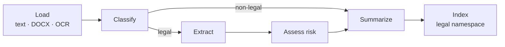
```mermaid
flowchart LR
    L[Load<br/>text · DOCX · OCR] --> CL[Classify]
    CL -->|legal| EX[Extract]
    CL -->|non-legal| SU
    EX --> RI[Assess risk]
    RI --> SU[Summarize]
    SU --> IX[Index<br/>legal namespace]
```

### Legal cross-document synthesis

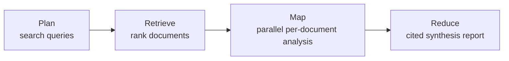
```mermaid
flowchart LR
    P[Plan<br/>search queries] --> R[Retrieve<br/>rank documents]
    R --> M[Map<br/>parallel per-document analysis]
    M --> Rd[Reduce<br/>cited synthesis report]
```

### Documentation generation

Template + reviewed drawings + comparisons → **generate** (temperature 0) → **align** to the template's sections and fields → **flag** missing required facts → **fact-check** every number against the sources → editable document → Word / Markdown export.

---

## Tech stack

| Layer | Technology |
|---|---|
| Frontend | Next.js 16 (App Router, Turbopack), React 19, JavaScript, `next/font`, `next/image`, `next/og`, lucide-react |
| Back end | Python, FastAPI, Uvicorn, Pydantic |
| Agents | LangGraph, LangChain text splitters |
| Models | OpenAI GPT-4.1 (engineering vision), GPT-4.1-mini (legal, OCR), GPT-3.5-turbo (medical chat), text-embedding-ada-002 |
| Retrieval | Pinecone serverless (1536-dim, cosine) |
| Documents | PyMuPDF (render, text, OCR input), ezdxf (DXF entities and rendering), Pillow, python-docx, PyPDF2, pandas |
| Storage | SQLite (WAL) for legal, engineering and contact data; files on disk |

---

## Project structure

```
Agentic_RAG_System/
├── backend/
│   ├── main.py                     # FastAPI app, routers, CORS
│   ├── core/config.py              # All settings (env vars)
│   ├── api/
│   │   ├── routes_chat.py          # Medical/general RAG chat
│   │   ├── routes_files.py         # PDF/CSV upload, replace, delete
│   │   ├── routes_legal.py         # Legal batches, documents, Q&A, synthesis
│   │   ├── routes_engineering.py   # Drawings, compare, templates, documents
│   │   ├── routes_contact.py       # Website contact form
│   │   ├── routes_auth.py          # Sign-in, sign-out, sessions, password change
│   │   ├── routes_admin.py         # Admin analytics, users, inbox, activity, system
│   │   ├── routes_analytics.py     # Cookie-less page-view beacon
│   │   ├── deps.py                 # require_user / require_admin
│   │   └── middleware.py           # Origin guard and activity logging
│   ├── services/
│   │   ├── rag_service.py, llm_service.py, embeddings_service.py, vectordb_service.py
│   │   ├── legal_agent_service.py, legal_document_loader.py, legal_prompts.py, legal_store.py
│   │   └── engineering_agent_service.py, engineering_loader.py, engineering_rules.py,
│   │       engineering_prompts.py, engineering_store.py, engineering_templates.py
│   │   ├── platform_store.py, security.py, usage_tracker.py   # Users, sessions, analytics, model cost
│   ├── manage.py                   # create-admin / reset-password
│   ├── data/                       # Runtime data (git-ignored): SQLite DBs, uploads
│   └── requirements.txt
├── frontend/
│   ├── app/
│   │   ├── (site)/                 # Home, solutions, about, contact (static)
│   │   ├── (auth)/login/           # Sign-in page
│   │   ├── (workspace)/workspace/  # The application (sign-in required, noindex)
│   │   ├── (workspace)/admin/      # Admin panel (admins only)
│   │   ├── sitemap.js, robots.js, manifest.js, opengraph-image.js, icon.svg, apple-icon.js
│   │   └── globals.css, styles/workspace.css
│   ├── components/site/            # Header, footer, breadcrumbs, JSON-LD, contact form
│   ├── components/workspace/       # Engineering, Legal, Medical, Status
│   ├── components/auth/            # AuthProvider, login form
│   ├── components/admin/           # Admin pages and SVG charts
│   ├── components/account/         # Account page
│   ├── lib/                        # site.js, content.js, structured-data.js, api.js, og.js
│   └── assets/                     # Product screenshots (static imports)
├── scripts/
│   ├── generate_engineering_samples.py   # Drawings with planted errors + answer key
│   └── generate_legal_corpus.py          # 100 fictional legal documents
├── datasets/
│   ├── engineering_samples/        # Generated drawings (PDF, DXF)
│   └── legal_corpus/               # Generated legal documents
└── docs/                           # Guides, audits, README images
```

---

## Getting started

### Prerequisites

- Python 3.12 (3.10+ required by the pinned dependencies)
- Node.js 20.9+
- An OpenAI API key with access to `gpt-4.1`, `gpt-4.1-mini`, `gpt-3.5-turbo` and `text-embedding-ada-002`
- A Pinecone account (serverless index, 1536 dimensions, cosine). The index is created automatically if missing.

### 1. Back end

```bash
cd backend
python3.12 -m venv venv
source venv/bin/activate
pip install --upgrade pip
pip install -r requirements.txt
cp env.example .env        # then add your keys (see Configuration)
python main.py             # http://localhost:8000  ·  docs at /docs
```

Create the first administrator (a temporary password is printed once and must be changed at first sign-in):

```bash
python manage.py create-admin --email you@example.com --name "Your Name"
# Forgotten password:
python manage.py reset-password --email you@example.com
```

### 2. Front end

```bash
cd frontend
cp .env.example .env.local # set NEXT_PUBLIC_SITE_URL before deploying
npm install
npm run dev                # http://localhost:3001
```

Production build:

```bash
npm run build && npm start # http://localhost:3001
```

### 3. Try it

1. Sign in at http://localhost:3001/login with the administrator account and choose a new password.
2. Generate the sample data (see [Sample data](#sample-data)).
3. **Engineering**: open `/workspace/engineering`, upload `datasets/engineering_samples/bracket_EP-1001_revA.pdf`, then revision B, and compare them.
4. **Legal**: open `/workspace/legal`, select the `datasets/legal_corpus` folder, watch the batch progress, then try *Synthesize*.
5. **Medical**: open `/workspace/medical`, upload a PDF from `backend/sample_documents/`, and ask a question.

---

## Configuration

### Back end (`backend/.env`)

| Variable | Default | Purpose |
|---|---|---|
| `OPENAI_API_KEY` | – | **Required.** OpenAI API key |
| `OPENAI_MODEL` | `gpt-3.5-turbo` | Medical/general chat model |
| `OPENAI_EMBEDDING_MODEL` | `text-embedding-ada-002` | Embeddings (1536-dim) |
| `PINECONE_API_KEY` | – | **Required.** Pinecone API key |
| `PINECONE_ENVIRONMENT` | – | **Required.** Region of the index, e.g. `us-east-1` |
| `PINECONE_INDEX_NAME` | `rag-documents` | Index name |
| `CHUNK_SIZE` / `CHUNK_OVERLAP` | `1000` / `200` | Chunking for medical documents |
| `MAX_RETRIEVAL_RESULTS` | `5` | Passages retrieved per chat question |
| `LEGAL_MODEL` | `gpt-4.1-mini` | Legal OCR, extraction, risk, Q&A, synthesis |
| `LEGAL_MAX_BATCH_DOCS` | `100` | Documents per upload batch |
| `LEGAL_WORKERS` | `4` | Documents analysed in parallel |
| `LEGAL_MAX_FILE_MB` | `25` | Maximum size per legal file |
| `LEGAL_OCR_MAX_PAGES` | `30` | OCR page limit per document |
| `LEGAL_FULL_TEXT_QA_CHARS` | `60000` | Single-document Q&A reads the full text below this size |
| `ENGINEERING_MODEL` | `gpt-4.1` | Engineering vision and review model |
| `ENGINEERING_MAX_PAGES` | `6` | Sheets reviewed per drawing |
| `ENGINEERING_MAX_FILE_MB` | `50` | Maximum size per drawing |
| `FRONTEND_ORIGINS` | `http://localhost:3001` | Browser origins allowed to call the API with cookies (comma-separated) |
| `SESSION_TTL_HOURS` | `168` | Session lifetime (7 days) |
| `COOKIE_SECURE` | `False` | Set `True` when serving over HTTPS |
| `LOGIN_MAX_ATTEMPTS` / `LOGIN_LOCKOUT_MINUTES` | `5` / `15` | Failed sign-ins per email before a temporary lockout |
| `PASSWORD_MIN_LENGTH` | `10` | Minimum password length |
| `ANALYTICS_ENABLED` | `True` | Cookie-less website page-view analytics (also switchable in Admin → Settings) |
| `SITE_REVALIDATE_URL` | `http://localhost:3001/api/revalidate` | Website endpoint called after posts or settings change |
| `REVALIDATE_SECRET` | – | Shared secret for on-demand revalidation (same value in `frontend/.env.local`) |
| `UPLOAD_MAX_MB` | `8` | Maximum image upload size |
| `OPENAI_BASE_URL` | – | Any OpenAI-compatible endpoint: Azure OpenAI or a self-hosted model, so documents stay in your infrastructure |
| `ENVIRONMENT` | `development` | `production` refuses to start with unsafe settings and lists what to fix |
| `TRUSTED_PROXIES` | – | Reverse-proxy IPs whose `X-Forwarded-For` is trusted |
| `DATA_ENCRYPTION_KEY` | auto key file | 32-byte base64 key for encrypting 2FA secrets at rest |
| `PUBLIC_SITE_URL` | `http://localhost:3001` | Website address used in emailed links |
| `SMTP_HOST` / `SMTP_PORT` / `SMTP_USER` / `SMTP_PASSWORD` / `SMTP_FROM` | – / `587` | Email for invitations and password resets (STARTTLS, or TLS on 465) |
| `MEDICAL_REDACT_PHI` | `True` | Redact identifiers in medical text before embedding or sending to the model |
| `MAX_PDF_PAGES` / `VIRUS_SCAN` | `1000` / `auto` | Upload limits; ClamAV scanning (`required` rejects uploads when no scanner is available) |
| `BACKUP_DIR` / `BACKUP_KEEP` / `BACKUP_INTERVAL_HOURS` | `backend/backups` / `14` / `24` | Automatic backups |
| `API_HOST` / `API_PORT` | `0.0.0.0` / `8000` | Server binding |

### Front end (`frontend/.env.local`)

| Variable | Default | Purpose |
|---|---|---|
| `NEXT_PUBLIC_SITE_URL` | `http://localhost:3001` | **Set before deploying.** Drives canonical URLs, sitemap, robots.txt, Open Graph URLs and structured data |
| `NEXT_PUBLIC_API_BASE` | `http://localhost:8000` | FastAPI back end |
| `NEXT_PUBLIC_CONTACT_EMAIL` | – | Optional email shown on the Contact page, footer and Organization schema |
| `API_INTERNAL_BASE` | `NEXT_PUBLIC_API_BASE` | API base used by the Next.js server when rendering blog pages (e.g. an internal hostname) |
| `REVALIDATE_SECRET` | – | Must match the back end's `REVALIDATE_SECRET` |

### Approximate costs (OpenAI)

| Operation | Cost | Time |
|---|---|---|
| Legal document analysis | ~$0.01–0.02 per document (`gpt-4.1-mini`) | ~20 s per document per worker |
| Engineering drawing review | ~$0.05–0.15 per drawing (`gpt-4.1`) | 30–60 s |
| Revision comparison | ~$0.05 | 15–20 s |
| Legal synthesis report | ~$0.02–0.05 | ~20 s |

---

## Sample data

Both generators create **fictional, clearly labelled** test data with known answers.

```bash
# Engineering: bracket rev A (5 planted errors), rev B (2 unrecorded changes), DXF flange (2 planted errors)
backend/venv/bin/python scripts/generate_engineering_samples.py

# Legal: 100 documents (85 TXT, 10 text PDFs, 5 image-only scanned PDFs)
backend/venv/bin/python scripts/generate_legal_corpus.py --count 100
```

`datasets/engineering_samples/answer_key.json` lists the planted errors and `datasets/legal_corpus/manifest.json` records each document's intended type and characteristics.

---

## API reference

Interactive documentation: **http://localhost:8000/docs**

All workspace endpoints (chat, files, legal, engineering) require a signed-in session cookie; `/admin/*` requires the admin role.

<details>
<summary><strong>Auth</strong></summary>

| Method | Endpoint | Description |
|---|---|---|
| `POST` | `/auth/login` | Sign in (`email`, `password`); sets the HttpOnly session cookie |
| `POST` | `/auth/logout` | Sign out and revoke the session |
| `GET` | `/auth/me` | Current user |
| `POST` | `/auth/change-password` | Change password (signs out other sessions) |
| `GET` | `/auth/sessions` | Active sessions |
| `POST` | `/auth/sessions/revoke-others` | Sign out all other sessions |
| `POST` | `/auth/login/mfa` | Second sign-in step (`mfa_token` from `/auth/login`, authenticator or recovery `code`) |
| `POST` | `/auth/2fa/setup` · `/auth/2fa/enable` | Start 2FA enrolment (secret, `otpauth://` URI, QR SVG) / confirm with a code (returns recovery codes once) |
| `POST` | `/auth/2fa/disable` · `/auth/2fa/recovery-codes` | Turn off 2FA (password + code) / regenerate recovery codes (password) |
| `POST` | `/auth/forgot-password` | Email a reset link (same response whether or not the account exists; rate limited) |
| `POST` | `/auth/reset-password/check` · `/auth/reset-password` | Check a reset/invite link / set the password with it (single use; signs out all sessions) |

</details>

<details>
<summary><strong>Admin</strong> (admin role)</summary>

| Method | Endpoint | Description |
|---|---|---|
| `GET` | `/admin/overview?days=` | KPIs, daily series, content counts, recent activity |
| `GET` | `/admin/traffic?days=` | Page views, visitors, top pages, referrers, devices |
| `GET` | `/admin/usage?days=` | Model calls, tokens and estimated cost by day, model, feature; actions per user |
| `GET` | `/admin/system` | Vector DB namespaces, storage, models, security settings |
| `GET` · `POST` | `/admin/users` | List / invite users (emails a single-use link; returns it only if email is not configured) |
| `PATCH` · `DELETE` | `/admin/users/{id}` | Change name, role or status / delete |
| `POST` | `/admin/users/{id}/reset-password` | Old password disabled, sessions revoked, reset link emailed |
| `POST` | `/admin/users/{id}/reset-2fa` | Turn off a user's 2FA (lost device), sessions revoked |
| `GET` | `/admin/messages?status=` · `/admin/messages.csv` | Contact inbox / CSV export |
| `PATCH` · `DELETE` | `/admin/messages/{id}` | Mark read or unread / delete |
| `GET` | `/admin/activity` · `/admin/activity.csv` | Audit log with filters / CSV export |
| `GET` | `/admin/realtime` | Visitors and signed-in users in the last 5 minutes, recent pages |
| `GET` | `/admin/traffic.csv?days=` | Daily page views, visitors and contact messages as CSV |
| `GET` · `POST` | `/admin/posts` | List posts (with views) / create |
| `GET` · `PUT` · `DELETE` | `/admin/posts/{id}` | Read / update (publish, unpublish, schedule) / delete |
| `GET` | `/admin/posts/{id}/stats` | Views, visitors, daily series and referrers for one post |
| `POST` | `/admin/posts/preview` | Render Markdown with the publishing sanitiser |
| `POST` | `/admin/uploads` | Upload an image (re-encoded to WebP, max 2000 px) |
| `GET` · `PUT` | `/admin/settings` | Announcement bar, contact-form and analytics switches |

</details>

<details>
<summary><strong>Analytics</strong> (public)</summary>

| Method | Endpoint | Description |
|---|---|---|
| `POST` | `/analytics/pageview` | Cookie-less page-view beacon (`text/plain` JSON `{path, referrer}`); always returns 204 |
| `GET` | `/public/posts` · `/public/posts/{slug}` | Published posts (scheduled posts appear at their publish time) |
| `GET` | `/public/settings` | Announcement bar and contact-form status |
| `GET` | `/public/uploads/{name}` | Uploaded images (immutable, cached for a year) |

</details>

<details>
<summary><strong>Chat and files</strong> (medical / general RAG)</summary>

| Method | Endpoint | Description |
|---|---|---|
| `POST` | `/chat/` | Ask a question (`query`) |
| `GET` | `/chat/health` | RAG health (vector DB + LLM) |
| `POST` | `/files/add_file` | Upload and index a PDF or CSV |
| `POST` | `/files/csv_info` | Preview a CSV (size, estimated documents and time) |
| `PUT` | `/files/update_file/{file_id}` | Replace a document's vectors |
| `DELETE` | `/files/delete_file/{file_id}` | Remove a document's vectors |
| `GET` | `/files/health` | Service health |
| `GET` | `/health` | API health |

</details>

<details>
<summary><strong>Legal</strong></summary>

| Method | Endpoint | Description |
|---|---|---|
| `POST` | `/legal/batches` | Upload documents (multipart `files`) and queue analysis |
| `GET` | `/legal/batches/latest` · `/legal/batches/{id}` | Batch progress |
| `GET` | `/legal/documents` | List (`doc_type`, `overall_risk`, `status`, `search`, `limit`, `offset`) |
| `GET` | `/legal/documents/{id}` | Full analysis |
| `POST` | `/legal/documents/{id}/retry` | Re-analyse |
| `DELETE` | `/legal/documents/{id}` | Delete document, analysis and vectors |
| `GET` | `/legal/corpus/stats` | Corpus statistics |
| `POST` | `/legal/ask` | Cited Q&A (`question`, optional `file_id`) |
| `POST` | `/legal/search` | Semantic passage search |
| `POST` | `/legal/synthesize` | Cross-document synthesis report |

</details>

<details>
<summary><strong>Engineering</strong></summary>

| Method | Endpoint | Description |
|---|---|---|
| `GET` | `/engineering/standards` | ISO and ASME checklists |
| `POST` | `/engineering/drawings` | Upload and review (multipart `file`, `standard` = `ISO`/`ASME`) |
| `GET` | `/engineering/drawings` · `/engineering/drawings/{id}` | Library and review detail |
| `GET` | `/engineering/drawings/{id}/pages/{n}` | Rendered sheet PNG |
| `POST` | `/engineering/drawings/{id}/review` | Re-run review (optionally other standard) |
| `POST` | `/engineering/drawings/{id}/ask` | Q&A about a drawing |
| `DELETE` | `/engineering/drawings/{id}` | Delete |
| `POST` | `/engineering/compare` | Compare two drawings (`a_id`, `b_id`) |
| `GET` | `/engineering/comparisons` | Saved comparisons |
| `GET` · `POST` | `/engineering/templates` | List / create templates |
| `PUT` · `DELETE` | `/engineering/templates/{id}` | Update (built-ins are copied) / delete |
| `POST` | `/engineering/templates/{id}/review` | AI template review with revised version |
| `POST` | `/engineering/templates/import` | Create a template from DOCX/PDF/TXT/MD |
| `POST` | `/engineering/documents/generate` | Fill a template from drawings and comparisons |
| `GET` · `PUT` · `DELETE` | `/engineering/documents/{id}` | Read / edit / delete a generated document |
| `GET` | `/engineering/documents/{id}/export?format=docx\|md` | Export |

</details>

<details>
<summary><strong>Contact</strong></summary>

| Method | Endpoint | Description |
|---|---|---|
| `POST` | `/contact` | Store a contact message (validated, honeypot, 5 per hour per IP). Saved to `backend/data/contact/messages.db` |

</details>

---

## Website: SEO and performance

| Area | Implementation |
|---|---|
| Rendering | All public pages are statically pre-rendered (SSG); solution pages use `generateStaticParams` |
| Metadata | Per-page title (template `%s \| AIDocumentAgent`), description, canonical URL, Open Graph and Twitter cards |
| Crawling | `sitemap.xml` (7 public URLs), `robots.txt` (workspace disallowed), workspace pages `noindex, nofollow` |
| Structured data | Organization, WebSite, SoftwareApplication, FAQPage (home) · Service (solutions) · AboutPage, ContactPage, CollectionPage · BreadcrumbList |
| Semantic HTML | One `<h1>` per page, landmark elements, labelled sections, breadcrumbs with `aria-current`, skip link |
| Images | Static imports through `next/image`: AVIF/WebP, fixed dimensions, `fetchPriority="high"` on the hero, lazy loading below the fold |
| Fonts | Self-hosted with `next/font` (no external requests, metric-matched fallbacks) |
| JavaScript | Server components by default; client code limited to navigation and the contact form on public pages |
| Icons | SVG favicon, multi-size `favicon.ico`, generated Apple touch icon, web manifest |
| Headers | `X-Content-Type-Options`, `Referrer-Policy`, `X-Frame-Options`, `Permissions-Policy`; `X-Powered-By` removed |

**Lighthouse (mobile emulation, production build, local machine)**

| Category | Score |
|---|---|
| Accessibility | 100 |
| Best practices | 100 |
| SEO | 100 |
| Performance | 86–97 (varies with machine load) |
| Cumulative Layout Shift | 0 |

Before going live, set `NEXT_PUBLIC_SITE_URL`, then verify with [PageSpeed Insights](https://pagespeed.web.dev/) and Google's [Rich Results Test](https://search.google.com/test/rich-results) against the deployed URL.

---

## Evaluation

Internal evaluations on **synthetic test data with planted errors and known answers**. Real documents will differ, so run a pilot on a representative sample.

| Test | Result |
|---|---|
| Engineering: planted drawing errors detected (bracket PDF + DXF flange) | **7 / 7** |
| Engineering: unrecorded revision changes identified (rev A → B) | **2 / 2** (material change correctly recognised as recorded) |
| Engineering: false datum claim rejected by zoomed verification | Rejected; true datum confirmed |
| Legal: documents processed from a 100-document batch | **100 / 100** (incl. 5 scanned PDFs via OCR) |
| Legal: classification matching intended type | **96 / 100** (the 4 others: settlement agreements labelled as contracts) |
| Legal: synthesis outliers matching planted "uncapped liability" contracts | **3 / 3** |

Re-measure at any time (for example before changing a model or prompt). This reads stored results, or re-analyses the samples with `--run`, and exits non-zero below the threshold:

```bash
backend/venv/bin/python scripts/evaluate_agents.py --min-score 0.8
# legal: classification 0.96 · governing law 0.99 · risk direction 0.94 — engineering: issue recall 1.0 (11/11)
```

Issues found during development, and the fixes now in place:
- A vision model invented a datum that isn't on the drawing → zoomed re-verification step.
- A model judged every change "recorded" → per-change revision audit.
- A model corrupted a value (`9.0` → `8.9.0`) → numeric fact-check on generated documents.
- Legal risk scores clustered at the midpoint → calibration rubric, with the risk level derived from the score in code.

---

## Quality assurance

Automated checks run locally and in CI (`.github/workflows/qa.yml`). The full results, the risk register and residual risks are in **[docs/QA_REPORT.md](docs/QA_REPORT.md)**.

| Suite | Tool | Result |
|---|---|---|
| Backend API tests: auth, 2FA, invitations and resets, per-user isolation, access control, CSRF/CORS, XSS sanitising, upload validation, encryption, prompt-injection detection, PHI redaction, backups | pytest (`backend/tests`) | **113 passed** |
| End-to-end: SEO and structured data on every page, broken links, sitemap/robots, mobile layout, console errors, security headers, nonce CSP, reset flow, access control | Playwright (`frontend/e2e`), desktop + mobile | **60 passed** |
| Accessibility (WCAG 2.1 A/AA) | axe-core | 0 serious or critical violations |
| Dependency audit | `npm audit` · `pip-audit` | **0 · 0** |
| Agent accuracy | `scripts/evaluate_agents.py` | Legal 96% / 99% / 94% · Engineering 11/11 |

```bash
cd backend && venv/bin/python -m pytest          # API tests (isolated temp data, no model calls)
cd frontend && npm run qa                          # lint + build + Playwright (site and API running)
PW_CHANNEL=chrome npm run test:e2e                 # use an installed Chrome
E2E_EMAIL=… E2E_PASSWORD=… npm run test:e2e        # include the signed-in journey
```

---

## Security and data handling

- **Authentication**: every workspace and admin API requires a session.
  - Session tokens live in an HttpOnly, SameSite=Lax cookie and are stored only as SHA-256 digests.
  - Passwords use PBKDF2-HMAC-SHA256 with 600,000 iterations.
  - Failed sign-ins are throttled.
  - Users are invite-only and set their own password by single-use emailed link; self-service reset works the same way.
  - Optional **TOTP two-factor authentication**, with hashed recovery codes and replay protection. Secrets are encrypted at rest (AES-256-GCM).
- **Data isolation**: every document, drawing, comparison, generated report and medical file has an owner. Members can only see or act on their own (other IDs return 404); vector searches are filtered by owner; admins see everything.
- **Security headers**:
  - Website: Content-Security-Policy (scripts from the site only, no framing, `object-src 'none'`), `nosniff`, `X-Frame-Options: DENY`, Referrer-Policy, Permissions-Policy, COOP, and HSTS when served over HTTPS. Sign-in, workspace and admin pages use a strict **per-request nonce** policy with `'strict-dynamic'`.
  - API: `nosniff`, `DENY`, `no-referrer`, `no-store` on auth and admin responses; no server banner.
- **CSRF and CORS**:
  - CORS allows only the configured `FRONTEND_ORIGINS` (credentials enabled);
  - an origin guard rejects state-changing requests from other origins;
  - CSV exports neutralise spreadsheet formula injection.
- **Uploads**: content must match the file extension (magic bytes), zip and decompression bombs are rejected, PDFs are page-limited, and files are scanned with ClamAV when installed.
- **Prompt injection**: agents treat document text as untrusted data inside fenced markers, and text that tries to instruct the AI is flagged as a risk or finding. The agents have no tools with side effects. This reduces the risk but cannot remove it entirely, so keep human review.
- **Backups**: automatic daily backups with rotation; `manage.py backup | list-backups | restore` (restores are integrity-checked and keep the previous data).
- **Before deploying**: set `ENVIRONMENT=production`. The API then refuses to start until HTTPS cookies, HTTPS origins, trusted proxies, the encryption key and a strong revalidation secret are configured. See the checklist in [docs/QA_REPORT.md](docs/QA_REPORT.md#production-checklist).
- **Audit trail**: sign-ins (including failures), workspace actions and admin changes are recorded in the activity log.
- **Analytics privacy**: no cookies, no stored IP addresses, daily-rotating anonymous visitor IDs, Do Not Track respected.
- Documents are processed by your back end and sent to **OpenAI** for analysis, or to Azure OpenAI or a self-hosted model via `OPENAI_BASE_URL`. Passages are indexed in **your** Pinecone project. Review the providers' terms before using confidential or regulated data.
- Uploaded files are stored under generated names; user-supplied filenames never form filesystem paths.
- Runtime data (`backend/data/`) and secrets (`.env`, `.env.local`) are git-ignored.
- Medical uploads drop identifier columns and redact identifiers inside values (emails, phones, SSNs, MRNs, full dates and so on). Names in free text can't be found reliably by pattern, so this is not a substitute for formal de-identification.
- AI output supports, and does not replace, qualified engineering, legal or clinical judgement.

---

## Troubleshooting

<details>
<summary><strong>Pinecone SSL error</strong> ("Max retries exceeded … SSLError")</summary>

Use a fresh venv with modern Python (3.11+) and install certificates:

```bash
pip install --upgrade pip certifi requests "urllib3<2.2"
```

`backend/core/config.py` sets `SSL_CERT_FILE`/`REQUESTS_CA_BUNDLE` from `certifi` automatically.
</details>

<details>
<summary><strong>Region mismatch or missing index</strong></summary>

Set `PINECONE_ENVIRONMENT` to your index's region (for example `us-east-1`). The index is created automatically with 1536 dimensions if it does not exist.
</details>

<details>
<summary><strong>Port 3001 already in use</strong></summary>

The front end is pinned to port 3001 (`package.json`). Stop the other process or change the port in the `dev` and `start` scripts, and update `NEXT_PUBLIC_SITE_URL`.
</details>

<details>
<summary><strong>Legal batch stalls</strong></summary>

If the machine sleeps during a batch, in-flight requests pause and resume after wake (OpenAI calls time out and retry after 90 s). Unfinished documents also resume automatically when the back end restarts.
</details>

<details>
<summary><strong>Status shows "Unhealthy"</strong></summary>

Open http://localhost:8000/files/health and check that `vectordb` and `llm` are `true`, then fix the keys or region in `backend/.env` and restart.
</details>

---

## Roadmap

### Near term: production readiness

- [x] **Authentication, roles and admin panel** with analytics, user management, contact inbox and audit log
- [x] **Per-user data isolation** (members see only their own documents; admins see all)
- [ ] Team/organisation sharing on top of per-user isolation
- [x] **Two-factor authentication** (TOTP with recovery codes)
- [x] **Automated QA**: API tests, end-to-end, accessibility and CI workflow
- [x] **Python 3.12 upgrade**: 0 dependency advisories
- [ ] Single sign-on (SAML/OIDC)
- [x] **Email delivery** for invitations and self-service password reset
- [x] **Risk register closed**: encryption at rest, upload validation, nonce CSP, backups, prompt-injection guard, production config check ([QA report](docs/QA_REPORT.md#risk-register-resolution))
- [ ] **Deployment**: Dockerfiles, `docker-compose`, and a guide for Vercel (front end) plus a container host (API)
- [x] **CI**: lint, build, API and end-to-end tests on every push and pull request
- [x] **Agent evaluation harness** scoring agents against the synthetic answer keys (`scripts/evaluate_agents.py`)
- [x] Contact-form admin inbox (read/unread, CSV export)
- [ ] **Contact form notifications** (email/Slack)
- [ ] Choose and add a licence

### Engineering

- [ ] Highlight findings directly on the sheet (bounding boxes and zoom-to-finding)
- [ ] Multi-sheet cross-references (section and detail callouts between sheets)
- [ ] Additional formats: DWG and STEP/PMI
- [ ] Additional standards: DIN, JIS, BS 8888
- [ ] Balloon numbering and automatic FAI characteristic tables from the drawing
- [ ] Custom rule sets per company drawing standard

### Legal

- [ ] Scale beyond 100 documents per batch towards 10,000: persistent job queue, horizontal workers, cost tracking
- [ ] Clause library and playbook comparison (deviation from your standard positions)
- [ ] Deadline calendar export (ICS) and reminders
- [ ] Contract comparison (redline-style differences between versions)

### Medical

- [ ] Show cited passages with every answer (not only the source count)
- [ ] Formal de-identification pipeline for free text and CSVs
- [ ] Guideline versioning and "what changed" comparisons

### Platform and website

- [ ] Streaming responses and progress for long-running agent steps
- [ ] Usage and cost dashboard per workspace
- [x] OpenAI-compatible provider switch (`OPENAI_BASE_URL`: Azure OpenAI, vLLM, Ollama)
- [ ] Native support for other model APIs (e.g. Claude)
- [x] Blog with admin editor, scheduling, SEO fields and on-demand revalidation
- [ ] Rich-text (WYSIWYG) editing option and post revision history
- [ ] Internationalisation (hreflang) on the website
- [ ] Field Core Web Vitals monitoring after deployment

---

## Further documentation

- [`frontend/README.md`](frontend/README.md): front-end structure and SEO checklist
- [`docs/TESTING_GUIDE.md`](docs/TESTING_GUIDE.md): testing scenarios and datasets
- [`docs/MEDICAL_RAG_GUIDE.md`](docs/MEDICAL_RAG_GUIDE.md): medical workspace guide
- [`docs/DATASET_PLANNING_GUIDE.md`](docs/DATASET_PLANNING_GUIDE.md): dataset planning
- [`CSV_UPLOAD_GUIDE.md`](CSV_UPLOAD_GUIDE.md): CSV upload details

> AIDocumentAgent is an AI-assisted tool. It supports, and does not replace, a qualified engineer's, lawyer's or clinician's review and approval.
