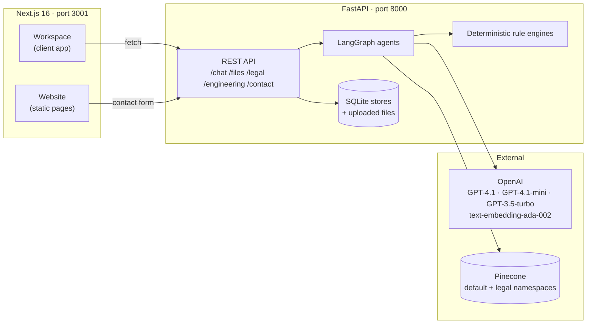
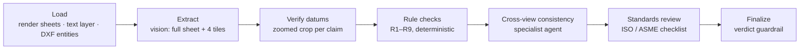
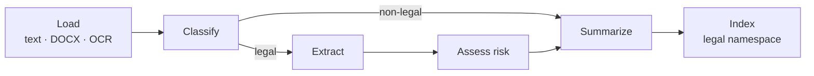
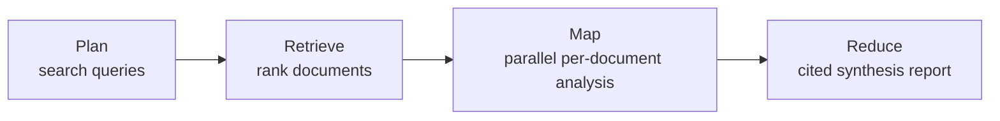

# AIDocumentAgent

**AI agents that read, check and document technical, legal and clinical files.**

AIDocumentAgent reviews engineering drawings against ISO and ASME standards, synthesises insights across whole collections of legal documents, and answers clinical questions from your own files. Every finding is located, every answer is sourced, and anything the system cannot verify is flagged instead of filled in.


<p align="center">
  <a href="#screenshots">Screenshots</a> ·
  <a href="#features">Features</a> ·
  <a href="#architecture">Architecture</a> ·
  <a href="#getting-started">Getting started</a> ·
  <a href="#configuration">Configuration</a> ·
  <a href="#api-reference">API</a> ·
  <a href="#evaluation">Evaluation</a> ·
  <a href="#roadmap">Roadmap</a>
</p>

---

## Contents

- [Overview](#overview)
- [Screenshots](#screenshots)
- [Features](#features)
- [Architecture](#architecture)
- [Agent workflows](#agent-workflows)
- [Tech stack](#tech-stack)
- [Project structure](#project-structure)
- [Getting started](#getting-started)
- [Configuration](#configuration)
- [Sample data](#sample-data)
- [API reference](#api-reference)
- [Website: SEO and performance](#website-seo-and-performance)
- [Evaluation](#evaluation)
- [Security and data handling](#security-and-data-handling)
- [Troubleshooting](#troubleshooting)
- [Roadmap](#roadmap)
- [Further documentation](#further-documentation)

---

## Overview

AIDocumentAgent has three parts:

| Part | What it is | Where |
|---|---|---|
| **Website** | Public marketing site: Home, Solutions, About, Contact. Statically rendered with full technical SEO. | `frontend/app/(site)` → http://localhost:3001 |
| **Workspace** | The application: Engineering, Legal and Medical workspaces plus system status. | `frontend/app/(workspace)` → http://localhost:3001/workspace |
| **API** | FastAPI back end running the LangGraph agents, vector search and storage. | `backend/` → http://localhost:8000/docs |

The three workspaces share one design principle: **models do the reading, but deterministic checks, targeted re-verification and explicit gap-flagging make the results auditable.** A qualified person always makes the final call.

---

## Screenshots

### Website

| Workflow | Verification guardrails |
|---|---|
|  |  |

| Engineering solution page | Measured results |
|---|---|
|  |  |

| About | Contact |
|---|---|
|  |  |

**Mobile** (390 px: home, navigation menu, contact form)


### Workspace

| Engineering: drawing review | Engineering: revision comparison |
|---|---|
|  |  |

| Legal: corpus dashboard | Medical: grounded Q&A |
|---|---|
|  |  |

---

## Features

### 📐 Engineering: drawing review and technical documentation

- **Drawing review** of PDF, PNG/JPG/TIFF and **DXF CAD** files against **ISO** (128, 129-1, 1101, 7200, 2768) or **ASME** (Y14.5, Y14.100, Y14.35) checklists.
- **Vision extraction** of title block, views, dimensions, tolerances, GD&T, datums, notes, revision table and BOM. Each sheet is read as a full image plus four zoomed tiles, combined with the exact PDF text layer or CAD entities.
- **Datum verification**: every claimed datum symbol is re-checked on a zoomed crop, and unconfirmed claims are dropped.
- **Deterministic rule checks**: title-block completeness, revision consistency, unit mixing, tolerance coverage, undefined datums, conflicting dimensions, sheet numbering, **CAD dimension text overridden to hide a geometry mismatch**, CAD units versus title block.
- **Cross-view consistency agent**: extents across views, dimension chains, callouts.
- **Verdict guardrail**: approved / approved with comments / rejected. The verdict can never be more lenient than the worst finding.
- **Revision comparison**: every change with form/fit/function impact, plus a **revision-control audit** that checks each substantive change against the new revision-table entries.
- **Documentation templates**: ECN, First Article Inspection (AS9102-style), Drawing Review Record, Release & Transmittal, Component Technical Specification. You can edit them, get an AI review with an improved version, or **import** your own from DOCX/PDF/TXT/MD.
- **Document generation** from reviewed drawings and comparisons, with export to **Word** and **Markdown**:
  - facts are copied from the sources; missing facts stay empty and are flagged;
  - drafted analysis is marked `[DRAFT]`;
  - **any number not found in the sources is flagged**.
- **Q&A about a drawing**, grounded in the images, extracted data and findings.

### ⚖️ Legal: document intelligence and cross-document synthesis

- **Batch ingestion** of up to 100 documents per batch (configurable). Documents are processed in the background, with progress tracking and automatic resume after a restart.
- **OCR** for scanned PDFs and images using a vision model; DOCX, TXT and MD are also supported.
- **Classification**: contract, court filing, case file, compliance record, other legal, non-legal, plus subtype and jurisdiction.
- **Structured extraction**: parties, key dates, obligations, monetary amounts, clauses and type-specific fields (liability caps, case numbers, remediation deadlines…).
- **Risk analysis**: calibrated 0–100 score, categorised risks with section references and recommendations, and missing protections.
- **Corpus dashboard**: document types, risk levels, risk categories, governing law, highest-risk documents, upcoming deadlines.
- **Cross-document synthesis** (plan → retrieve → map → reduce): a cited report with themes, comparisons, risks, outliers and recommendations.
- **Cited Q&A** (full-document reading for short single documents, retrieval otherwise) and **semantic search**.
- Legal vectors live in a **dedicated Pinecone namespace**, isolated from the rest of the index.

### 🩺 Medical: clinical Q&A over your own documents

- Upload **PDFs and CSV datasets**. CSVs get a size and time estimate before upload.
- **Grounded answers** from retrieved passages, with a source count; the assistant says when the context is insufficient.
- **Identifier removal**: CSV columns that look like patient identifiers (names, IDs, contact details, dates of birth) are dropped before indexing.
- Replace or delete indexed documents at any time.

### 🌐 Website

- Next.js App Router in **JavaScript**, statically rendered public pages.
- Design system: ink sections with a drafting-grid motif, one indigo accent, Inter + JetBrains Mono via `next/font`, and real product screenshots with drawing-style callouts.
- **Technical SEO**:
  - metadata and canonical URLs on every page;
  - `sitemap.xml`, `robots.txt`, web manifest;
  - generated Open Graph images;
  - JSON-LD structured data and semantic HTML.
- Contact form with client and server validation, a honeypot and per-IP rate limiting.

---

## Architecture



**Design decisions**

| Decision | Why |
|---|---|
| **LangGraph** workflows with one specialist agent per step | Each step has a narrow prompt and its own output schema, so it can be tested and inspected on its own. |
| **Deterministic checks alongside models** | Rules such as revision consistency, unit mixing and undefined datums are exact in code and don't vary between runs. |
| **Targeted re-verification** | Vision models sometimes "see" plausible details, such as a datum the design would normally have. A narrow yes/no check on a zoomed crop catches this. |
| **Numeric fact-checking** of generated documents | A corrupted value like `8.9.0` for `9.0` does real damage in engineering documentation. |
| **Separate Pinecone namespace** for legal vectors | The general Chat never retrieves contract passages. |
| **SQLite** for legal, engineering and contact data | Zero-ops, safe for concurrent background workers (WAL mode), easy to inspect. |
| **Static public pages + client-only workspace** | Public pages are fast and crawlable; the app is `noindex` and loads its own stylesheet. |

---

## Agent workflows

### Engineering drawing review



The revision comparison adds a **revision audit** step. Each substantive change is checked against the revision-table entries added in the new revision; whether the revision was incremented is computed in code.

### Legal document pipeline



### Legal cross-document synthesis



### Documentation generation

Template + reviewed drawings + comparisons → **generate** (temperature 0) → **align** to the template's sections and fields → **flag** missing required facts → **fact-check** every number against the sources → editable document → Word / Markdown export.

---

## Tech stack

| Layer | Technology |
|---|---|
| Frontend | Next.js 16 (App Router, Turbopack), React 19, JavaScript, `next/font`, `next/image`, `next/og`, lucide-react |
| Back end | Python, FastAPI, Uvicorn, Pydantic |
| Agents | LangGraph, LangChain text splitters |
| Models | OpenAI GPT-4.1 (engineering vision), GPT-4.1-mini (legal, OCR), GPT-3.5-turbo (medical chat), text-embedding-ada-002 |
| Retrieval | Pinecone serverless (1536-dim, cosine) |
| Documents | PyMuPDF (render, text, OCR input), ezdxf (DXF entities and rendering), Pillow, python-docx, PyPDF2, pandas |
| Storage | SQLite (WAL) for legal, engineering and contact data; files on disk |

---

## Project structure

```
Agentic_RAG_System/
├── backend/
│   ├── main.py                     # FastAPI app, routers, CORS
│   ├── core/config.py              # All settings (env vars)
│   ├── api/
│   │   ├── routes_chat.py          # Medical/general RAG chat
│   │   ├── routes_files.py         # PDF/CSV upload, replace, delete
│   │   ├── routes_legal.py         # Legal batches, documents, Q&A, synthesis
│   │   ├── routes_engineering.py   # Drawings, compare, templates, documents
│   │   └── routes_contact.py       # Website contact form
│   ├── services/
│   │   ├── rag_service.py, llm_service.py, embeddings_service.py, vectordb_service.py
│   │   ├── legal_agent_service.py, legal_document_loader.py, legal_prompts.py, legal_store.py
│   │   └── engineering_agent_service.py, engineering_loader.py, engineering_rules.py,
│   │       engineering_prompts.py, engineering_store.py, engineering_templates.py
│   ├── data/                       # Runtime data (git-ignored): SQLite DBs, uploads
│   └── requirements.txt
├── frontend/
│   ├── app/
│   │   ├── (site)/                 # Home, solutions, about, contact (static)
│   │   ├── (workspace)/workspace/  # The application (noindex)
│   │   ├── sitemap.js, robots.js, manifest.js, opengraph-image.js, icon.svg, apple-icon.js
│   │   └── globals.css, styles/workspace.css
│   ├── components/site/            # Header, footer, breadcrumbs, JSON-LD, contact form
│   ├── components/workspace/       # Engineering, Legal, Medical, Status
│   ├── lib/                        # site.js, content.js, structured-data.js, api.js, og.js
│   └── assets/                     # Product screenshots (static imports)
├── scripts/
│   ├── generate_engineering_samples.py   # Drawings with planted errors + answer key
│   └── generate_legal_corpus.py          # 100 fictional legal documents
├── datasets/
│   ├── engineering_samples/        # Generated drawings (PDF, DXF)
│   └── legal_corpus/               # Generated legal documents
└── docs/                           # Guides, audits, README images
```

---

## Getting started

### Prerequisites

- Python 3.9+ (3.11+ recommended)
- Node.js 20.9+
- An OpenAI API key with access to `gpt-4.1`, `gpt-4.1-mini`, `gpt-3.5-turbo` and `text-embedding-ada-002`
- A Pinecone account (serverless index, 1536 dimensions, cosine). The index is created automatically if missing.

### 1. Back end

```bash
cd backend
python3 -m venv venv
source venv/bin/activate
pip install --upgrade pip
pip install -r requirements.txt
cp env.example .env        # then add your keys (see Configuration)
python main.py             # http://localhost:8000  ·  docs at /docs
```

### 2. Front end

```bash
cd frontend
cp .env.example .env.local # set NEXT_PUBLIC_SITE_URL before deploying
npm install
npm run dev                # http://localhost:3001
```

Production build:

```bash
npm run build && npm start # http://localhost:3001
```

### 3. Try it

1. Generate the sample data (see [Sample data](#sample-data)).
2. **Engineering**: open `/workspace/engineering`, upload `datasets/engineering_samples/bracket_EP-1001_revA.pdf`, then revision B, and compare them.
3. **Legal**: open `/workspace/legal`, select the `datasets/legal_corpus` folder, watch the batch progress, then try *Synthesize*.
4. **Medical**: open `/workspace/medical`, upload a PDF from `backend/sample_documents/`, and ask a question.

---

## Configuration

### Back end (`backend/.env`)

| Variable | Default | Purpose |
|---|---|---|
| `OPENAI_API_KEY` | – | **Required.** OpenAI API key |
| `OPENAI_MODEL` | `gpt-3.5-turbo` | Medical/general chat model |
| `OPENAI_EMBEDDING_MODEL` | `text-embedding-ada-002` | Embeddings (1536-dim) |
| `PINECONE_API_KEY` | – | **Required.** Pinecone API key |
| `PINECONE_ENVIRONMENT` | – | **Required.** Region of the index, e.g. `us-east-1` |
| `PINECONE_INDEX_NAME` | `rag-documents` | Index name |
| `CHUNK_SIZE` / `CHUNK_OVERLAP` | `1000` / `200` | Chunking for medical documents |
| `MAX_RETRIEVAL_RESULTS` | `5` | Passages retrieved per chat question |
| `LEGAL_MODEL` | `gpt-4.1-mini` | Legal OCR, extraction, risk, Q&A, synthesis |
| `LEGAL_MAX_BATCH_DOCS` | `100` | Documents per upload batch |
| `LEGAL_WORKERS` | `4` | Documents analysed in parallel |
| `LEGAL_MAX_FILE_MB` | `25` | Maximum size per legal file |
| `LEGAL_OCR_MAX_PAGES` | `30` | OCR page limit per document |
| `LEGAL_FULL_TEXT_QA_CHARS` | `60000` | Single-document Q&A reads the full text below this size |
| `ENGINEERING_MODEL` | `gpt-4.1` | Engineering vision and review model |
| `ENGINEERING_MAX_PAGES` | `6` | Sheets reviewed per drawing |
| `ENGINEERING_MAX_FILE_MB` | `50` | Maximum size per drawing |
| `API_HOST` / `API_PORT` | `0.0.0.0` / `8000` | Server binding |

### Front end (`frontend/.env.local`)

| Variable | Default | Purpose |
|---|---|---|
| `NEXT_PUBLIC_SITE_URL` | `http://localhost:3001` | **Set before deploying.** Drives canonical URLs, sitemap, robots.txt, Open Graph URLs and structured data |
| `NEXT_PUBLIC_API_BASE` | `http://localhost:8000` | FastAPI back end |
| `NEXT_PUBLIC_CONTACT_EMAIL` | – | Optional email shown on the Contact page, footer and Organization schema |

### Approximate costs (OpenAI)

| Operation | Cost | Time |
|---|---|---|
| Legal document analysis | ~$0.01–0.02 per document (`gpt-4.1-mini`) | ~20 s per document per worker |
| Engineering drawing review | ~$0.05–0.15 per drawing (`gpt-4.1`) | 30–60 s |
| Revision comparison | ~$0.05 | 15–20 s |
| Legal synthesis report | ~$0.02–0.05 | ~20 s |

---

## Sample data

Both generators create **fictional, clearly labelled** test data with known answers.

```bash
# Engineering: bracket rev A (5 planted errors), rev B (2 unrecorded changes), DXF flange (2 planted errors)
backend/venv/bin/python scripts/generate_engineering_samples.py

# Legal: 100 documents (85 TXT, 10 text PDFs, 5 image-only scanned PDFs)
backend/venv/bin/python scripts/generate_legal_corpus.py --count 100
```

`datasets/engineering_samples/answer_key.json` lists the planted errors and `datasets/legal_corpus/manifest.json` records each document's intended type and characteristics.

---

## API reference

Interactive documentation: **http://localhost:8000/docs**

<details>
<summary><strong>Chat and files</strong> (medical / general RAG)</summary>

| Method | Endpoint | Description |
|---|---|---|
| `POST` | `/chat/` | Ask a question (`query`) |
| `GET` | `/chat/health` | RAG health (vector DB + LLM) |
| `POST` | `/files/add_file` | Upload and index a PDF or CSV |
| `POST` | `/files/csv_info` | Preview a CSV (size, estimated documents and time) |
| `PUT` | `/files/update_file/{file_id}` | Replace a document's vectors |
| `DELETE` | `/files/delete_file/{file_id}` | Remove a document's vectors |
| `GET` | `/files/health` | Service health |
| `GET` | `/health` | API health |

</details>

<details>
<summary><strong>Legal</strong></summary>

| Method | Endpoint | Description |
|---|---|---|
| `POST` | `/legal/batches` | Upload documents (multipart `files`) and queue analysis |
| `GET` | `/legal/batches/latest` · `/legal/batches/{id}` | Batch progress |
| `GET` | `/legal/documents` | List (`doc_type`, `overall_risk`, `status`, `search`, `limit`, `offset`) |
| `GET` | `/legal/documents/{id}` | Full analysis |
| `POST` | `/legal/documents/{id}/retry` | Re-analyse |
| `DELETE` | `/legal/documents/{id}` | Delete document, analysis and vectors |
| `GET` | `/legal/corpus/stats` | Corpus statistics |
| `POST` | `/legal/ask` | Cited Q&A (`question`, optional `file_id`) |
| `POST` | `/legal/search` | Semantic passage search |
| `POST` | `/legal/synthesize` | Cross-document synthesis report |

</details>

<details>
<summary><strong>Engineering</strong></summary>

| Method | Endpoint | Description |
|---|---|---|
| `GET` | `/engineering/standards` | ISO and ASME checklists |
| `POST` | `/engineering/drawings` | Upload and review (multipart `file`, `standard` = `ISO`/`ASME`) |
| `GET` | `/engineering/drawings` · `/engineering/drawings/{id}` | Library and review detail |
| `GET` | `/engineering/drawings/{id}/pages/{n}` | Rendered sheet PNG |
| `POST` | `/engineering/drawings/{id}/review` | Re-run review (optionally other standard) |
| `POST` | `/engineering/drawings/{id}/ask` | Q&A about a drawing |
| `DELETE` | `/engineering/drawings/{id}` | Delete |
| `POST` | `/engineering/compare` | Compare two drawings (`a_id`, `b_id`) |
| `GET` | `/engineering/comparisons` | Saved comparisons |
| `GET` · `POST` | `/engineering/templates` | List / create templates |
| `PUT` · `DELETE` | `/engineering/templates/{id}` | Update (built-ins are copied) / delete |
| `POST` | `/engineering/templates/{id}/review` | AI template review with revised version |
| `POST` | `/engineering/templates/import` | Create a template from DOCX/PDF/TXT/MD |
| `POST` | `/engineering/documents/generate` | Fill a template from drawings and comparisons |
| `GET` · `PUT` · `DELETE` | `/engineering/documents/{id}` | Read / edit / delete a generated document |
| `GET` | `/engineering/documents/{id}/export?format=docx\|md` | Export |

</details>

<details>
<summary><strong>Contact</strong></summary>

| Method | Endpoint | Description |
|---|---|---|
| `POST` | `/contact` | Store a contact message (validated, honeypot, 5 per hour per IP). Saved to `backend/data/contact/messages.db` |

</details>

---

## Website: SEO and performance

| Area | Implementation |
|---|---|
| Rendering | All public pages are statically pre-rendered (SSG); solution pages use `generateStaticParams` |
| Metadata | Per-page title (template `%s \| AIDocumentAgent`), description, canonical URL, Open Graph and Twitter cards |
| Crawling | `sitemap.xml` (7 public URLs), `robots.txt` (workspace disallowed), workspace pages `noindex, nofollow` |
| Structured data | Organization, WebSite, SoftwareApplication, FAQPage (home) · Service (solutions) · AboutPage, ContactPage, CollectionPage · BreadcrumbList |
| Semantic HTML | One `<h1>` per page, landmark elements, labelled sections, breadcrumbs with `aria-current`, skip link |
| Images | Static imports through `next/image`: AVIF/WebP, fixed dimensions, `fetchPriority="high"` on the hero, lazy loading below the fold |
| Fonts | Self-hosted with `next/font` (no external requests, metric-matched fallbacks) |
| JavaScript | Server components by default; client code limited to navigation and the contact form on public pages |
| Icons | SVG favicon, multi-size `favicon.ico`, generated Apple touch icon, web manifest |
| Headers | `X-Content-Type-Options`, `Referrer-Policy`, `X-Frame-Options`, `Permissions-Policy`; `X-Powered-By` removed |

**Lighthouse (mobile emulation, production build, local machine)**

| Category | Score |
|---|---|
| Accessibility | 100 |
| Best practices | 100 |
| SEO | 100 |
| Performance | 86–97 (varies with machine load) |
| Cumulative Layout Shift | 0 |

Before going live, set `NEXT_PUBLIC_SITE_URL`, then verify with [PageSpeed Insights](https://pagespeed.web.dev/) and Google's [Rich Results Test](https://search.google.com/test/rich-results) against the deployed URL.

---

## Evaluation

Internal evaluations on **synthetic test data with planted errors and known answers**. Real documents will differ, so run a pilot on a representative sample.

| Test | Result |
|---|---|
| Engineering: planted drawing errors detected (bracket PDF + DXF flange) | **7 / 7** |
| Engineering: unrecorded revision changes identified (rev A → B) | **2 / 2** (material change correctly recognised as recorded) |
| Engineering: false datum claim rejected by zoomed verification | Rejected; true datum confirmed |
| Legal: documents processed from a 100-document batch | **100 / 100** (incl. 5 scanned PDFs via OCR) |
| Legal: classification matching intended type | **96 / 100** (the 4 others: settlement agreements labelled as contracts) |
| Legal: synthesis outliers matching planted "uncapped liability" contracts | **3 / 3** |

Issues found during development, and the fixes now in place:
- A vision model invented a datum that isn't on the drawing → zoomed re-verification step.
- A model judged every change "recorded" → per-change revision audit.
- A model corrupted a value (`9.0` → `8.9.0`) → numeric fact-check on generated documents.
- Legal risk scores clustered at the midpoint → calibration rubric, with the risk level derived from the score in code.

---

## Security and data handling

- **No authentication yet.** The API and workspace assume a trusted local or private network. CORS is open (`*`). Do not expose the back end publicly until authentication is added (see [Roadmap](#roadmap)).
- Documents are processed by your back end and sent to **OpenAI** for analysis. Passages are indexed in **your** Pinecone project. Review the providers' terms before using confidential or regulated data.
- Uploaded files are stored under generated names; user-supplied filenames never form filesystem paths.
- Runtime data (`backend/data/`) and secrets (`.env`, `.env.local`) are git-ignored.
- Medical identifier removal is **column-name based** and is not a substitute for formal de-identification.
- AI output supports, and does not replace, qualified engineering, legal or clinical judgement.

---

## Troubleshooting

<details>
<summary><strong>Pinecone SSL error</strong> ("Max retries exceeded … SSLError")</summary>

Use a fresh venv with modern Python (3.11+) and install certificates:

```bash
pip install --upgrade pip certifi requests "urllib3<2.2"
```

`backend/core/config.py` sets `SSL_CERT_FILE`/`REQUESTS_CA_BUNDLE` from `certifi` automatically.
</details>

<details>
<summary><strong>Region mismatch or missing index</strong></summary>

Set `PINECONE_ENVIRONMENT` to your index's region (for example `us-east-1`). The index is created automatically with 1536 dimensions if it does not exist.
</details>

<details>
<summary><strong>Port 3001 already in use</strong></summary>

The front end is pinned to port 3001 (`package.json`). Stop the other process or change the port in the `dev` and `start` scripts, and update `NEXT_PUBLIC_SITE_URL`.
</details>

<details>
<summary><strong>Legal batch stalls</strong></summary>

If the machine sleeps during a batch, in-flight requests pause and resume after wake (OpenAI calls time out and retry after 90 s). Unfinished documents also resume automatically when the back end restarts.
</details>

<details>
<summary><strong>Status shows "Unhealthy"</strong></summary>

Open http://localhost:8000/files/health and check that `vectordb` and `llm` are `true`, then fix the keys or region in `backend/.env` and restart.
</details>

---

## Roadmap

### Near term: production readiness

- [ ] **Authentication and per-user workspaces** (API keys or OAuth; scoped data per user/team)
- [ ] **Deployment**: Dockerfiles, `docker-compose`, and a guide for Vercel (front end) plus a container host (API)
- [ ] **CI**: lint, build and tests on every pull request
- [ ] **Automated tests**: pytest for rule engines and stores, Playwright end-to-end tests, and an evaluation harness that scores agents against the synthetic answer keys
- [ ] **Contact form notifications** (email/Slack) and a simple admin inbox
- [ ] Remove the committed `backend/venv/` from the repository; move to Python 3.11+
- [ ] Choose and add a licence

### Engineering

- [ ] Highlight findings directly on the sheet (bounding boxes and zoom-to-finding)
- [ ] Multi-sheet cross-references (section and detail callouts between sheets)
- [ ] Additional formats: DWG and STEP/PMI
- [ ] Additional standards: DIN, JIS, BS 8888
- [ ] Balloon numbering and automatic FAI characteristic tables from the drawing
- [ ] Custom rule sets per company drawing standard

### Legal

- [ ] Scale beyond 100 documents per batch towards 10,000: persistent job queue, horizontal workers, cost tracking
- [ ] Clause library and playbook comparison (deviation from your standard positions)
- [ ] Deadline calendar export (ICS) and reminders
- [ ] Contract comparison (redline-style differences between versions)

### Medical

- [ ] Show cited passages with every answer (not only the source count)
- [ ] Formal de-identification pipeline for free text and CSVs
- [ ] Guideline versioning and "what changed" comparisons

### Platform and website

- [ ] Streaming responses and progress for long-running agent steps
- [ ] Usage and cost dashboard per workspace
- [ ] Model provider abstraction (e.g. Claude, Azure OpenAI, local models)
- [ ] Blog / case-study section and internationalisation (hreflang) on the website
- [ ] Field Core Web Vitals monitoring after deployment

---

## Further documentation

- [`frontend/README.md`](frontend/README.md): front-end structure and SEO checklist
- [`docs/TESTING_GUIDE.md`](docs/TESTING_GUIDE.md): testing scenarios and datasets
- [`docs/MEDICAL_RAG_GUIDE.md`](docs/MEDICAL_RAG_GUIDE.md): medical workspace guide
- [`docs/DATASET_PLANNING_GUIDE.md`](docs/DATASET_PLANNING_GUIDE.md): dataset planning
- [`CSV_UPLOAD_GUIDE.md`](CSV_UPLOAD_GUIDE.md): CSV upload details

> AIDocumentAgent is an AI-assisted tool. It supports, and does not replace, a qualified engineer's, lawyer's or clinician's review and approval.
